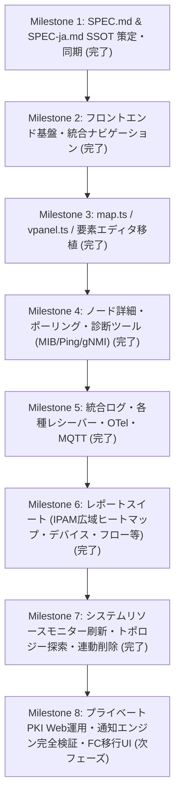

# TWSNMP NEO (twsnmpneo) 開発仕様書 (SPEC-ja.md)

本仕様書は、コンテナ型ネットワーク管理ソフトウェア「TWSNMP FC」およびデスクトップ版「TWSNMP FK」の後継・統合エディションである **「TWSNMP NEO」** のアーキテクチャ設計、実装仕様、および運用ワークフローを定義するものである。
Google Antigravity 2.0 は本仕様書（および英語版 `SPEC.md`）を単一の信頼できる情報源（Single Source of Truth: SSOT）として厳格に参照し、実装・テスト・ビルド設定を自律的に進めること。

---

## 1. プロジェクト概要と目標

* **プロジェクト名称**: TWSNMP NEO
* **コンテナ名 / リポジトリ名**: `twsnmpneo`
* **継承元**: **TWSNMP FC**（コンテナ・Web版）と **TWSNMP FK**（デスクトップ・多機能版）の長所を統合した直系後継ソフトウェア。
* **主要目標**:
  1. **技術スタックの全面刷新**: レガシーな依存関係を一新し、Go 1.23+ バックエンドと Svelte 5（Runes: `$state`, `$derived`, `$props`）+ Vite + TypeScript による高パフォーマンスなモダンWebアーキテクチャを確立。
  2. **`twsnmpfk` マップ（`map.ts`）との 100% 視覚・操作互換性**:
     - `twsnmpfk/frontend/src/lib/map.ts` の p5.js キャンバス描画エンジンを直接移植。
     - **ノード (Nodes)**: 標準MDIフォントアイコン、カスタム画像アイコン、障害点滅、状態カラー発光、ラベル位置調整。
     - **ネットワーク (Networks / Network Port Panel)**: 物理/論理スイッチングハブ・ルーター・サブネットを表すコンテナ。ポート画像（`port.png`）、Link UP/DOWN LED（緑/灰）、ポート番号・名称表示、折り返し（`HPorts`）、ポート単位の接続座標計算（`getLinePos`）を再現。
     - **ライン (Lines)**: ノード間およびノード-ネットワークポート間の接続描画、障害状態カラー、帯域使用率に応じた線の太さ、パケットフロー方向アニメーション。
     - **描画アイテム (Draw Items: 全11種)**: 矩形、楕円、テキスト、静的画像、クラシックゲージ、円形ラジアルゲージ、横棒グラフ、折れ線スパークライン、KPIカード（リアルタイムポーリング数値連動）。
     - **操作性**: ドラッグ＆ドロップ配置、Shift+クリックによるライン編集、複数選択、ホイールズーム・パン、背景画像、コンテキストメニュー（ノード編集、ポーリング、MIBブラウザ、Ping、トポロジー探索等）。
     - **音声通知**: 警告ビープ音（High/Low）、Ping応答音。
  3. **3D 仮想ハードウェアパネル（`vpanel.ts`）の直接移植**:
     - `twsnmpfk/frontend/src/lib/vpanel.ts` を p5.js WEBGL 3D キャンバス描画で完全移植。
     - 3D筐体、RJ45ポートテクスチャ、Link UP/DOWN緑色LED、1Gbps+通信橙色LED、背面LED、POWER青色LED、3D軌道回転（Orbit Controls）、自動回転、ポート折り返し設定。
  4. **マップ要素エディタ & 各種操作ダイアログ**:
     - **ノード編集 (`NodeDialog.svelte`)**: 名前、IP/MACアドレス、SNMP (v1/v2c/v3)、MDIアイコン、カスタム画像、認証情報、自動検出 (`NodeAutoDetectDialog`)。
     - **ネットワーク編集 (`NetworkDialog.svelte`)**: CIDR、説明、ポート設定、LLDP、ARP監視、ポート定義インポート/エクスポート。
     - **ネットワーク一括ライン編集 (`NetworkLinesDialog.svelte`)**: SW-HUBのポート一括接続管理。
     - **接続先トポロジー探索 (`FindNeighborDialog.svelte`)**: ARPテーブルやLLDP/CDP情報を基に接続先を自動探索・ライン自動生成。
     - **描画アイテム編集 (`DrawItemDialog.svelte`)**: テキスト、形状、画像、ポーリング連動ゲージ、KPIカード、ダーク/ライトプレビュー。
     - **ライン編集 (`LineDialog.svelte`)**: 接続ノード/ネットワーク選択、双方向トラフィックポーリング紐付け、スタイル・色・線幅設定。
  5. **分析 & レポートスイート（8系統）の完全移植**:
     - **デバイス分析**: LANデバイス（MAC/ベンダーOUI/IP）、Bluetooth、Wi-Fiアクセスポイント、スイッチFDBテーブル、ポートテーブル。
     - **IPAM（IPアドレス管理）**: 複数サブネット範囲登録、広域アドレス対応ヒートマップ（ECharts集約ブロック＋クリックドリルダウン展開）、IPv4/IPv6インベントリ、ホスト間通信グラフ。
     - **フロー & トラフィック分析**: Topサーバーポート、NetFlow/IPFIX統計、Fumbleフロー（未応答SYN/スキャン等の異常通信）、パケット種別分布、DNSクエリ、RADIUS、TLS、GeoIP位置解決。
     - **Windows & ホスト分析**: WindowsイベントID、ログオン監査、アカウント変更、Kerberos、特権昇格、プロセス活動、タスクスケジュール。
     - **IoT & センサー監視**: 環境センサー（温度/湿度）、電力消費量（Wh）、動体検知、SDR無線信号強度、MQTTトピック/クライアント。
     - **セキュリティ & 証明書監視**: TLS/SSLサーバー証明書有効期限追跡、プライベートPKI認証局管理。
     - **AI 異常検知**: ノードおよびポーリングのAI異常スコアリスト (`AIList`)。
  6. **運用・診断ツール**:
     - **MIBブラウザ & MIBツリーエクスプローラ**: 標準・Enterprise MIBの階層ナビゲーション、SNMP Get / GetNext / Walk / Table 実行、Table結果のページネーション、直近の検索履歴と頻出MIB項目のワンクリック入力。
     - **リアルタイム Ping ツール**: 連続ICMP/UDP ping、レスポンス推移グラフ、ペイロード変更、応答音声再生。
     - **gNMI ツール & Wake-on-LAN (WOL)**。
     - **ネットワーク自動発見エンジン**: IPレンジスキャン、Ping/SNMP/ARP同時スイープ、一括登録。
  7. **総合ログビューア & Apache Parquet ストレージ**:
     - EventLog、Syslog、SNMP TRAP、NetFlow/IPFIX、sFlow、ARP Watch、OpenTelemetry、MQTT の各専用ビューア。
     - Apache Parquet 列指向圧縮保存による超高速クエリ、全カラムソート、詳細フィルタ、1万件取得、ページネーション、件数バッジ常時表示、受信推移グラフ連動、総合レポートモーダル (`LogReportModal`)。
  8. **ネイティブ AI & MCP (Model Context Protocol) 統合**:
     - `tensai` によるマルチLLM（Gemini, OpenAI, Claude, Ollama）オーケストレーション。
     - SSE / Stdio 経由でシステムメトリクス、トポロジー、ログ、診断ツールを外部AIエージェントに公開するビルトイン MCP サーバー。
     - インラインAI支援ダイアログ（ログ原因分析、ポーリング生成支援、ノード診断）。
  9. **シングルバイナリ配布**:
     - Svelte 5 でビルドされたフロントエンド資産を Go の `embed.FS` で単一実行ファイルに完全内包。

---

## 2. 技術スタック & 動作環境

### 2.1 バックエンド (Go)
* **言語バージョン**: Go 1.23+
* **データストレージ**:
  * **bbolt**: システム設定、トポロジー情報（Nodes, Networks, Lines, DrawItems）、ポーリング定義、認証情報、PKI、イベントログ
  * **Apache Parquet**: Syslog、SNMP TRAP、NetFlow/IPFIX、sFlow、MQTT、ポーリング時系列ログ（列指向圧縮、高速フィルタ、容量・日数指定による安全な自動ローテーション）
* **AI & Agent 統合**:
  * `tensai`: マルチLLMクライアント（Gemini, OpenAI, Claude, Ollama）
  * 内蔵 **MCP サーバー** (`github.com/modelcontextprotocol/go-sdk`): SSE および Stdio による診断・トポロジー・ログツール群の提供
* **内蔵プロトコルレシーバー & サーバー**:
  * Syslog (UDP, TCP, TLS / RFC3164, RFC5424)
  * SNMP TRAP (v1, v2c, v3) + MIB OID 名前解決
  * NetFlow v5 / v9 / IPFIX
  * sFlow v5 (Flow Samples / Counter Samples)
  * ARP Watch (サブネット監視、IP-MAC変更・競合検知)
  * OpenTelemetry (OTel OTLP gRPC/HTTP レシーバー)
  * 内蔵 MQTT ブローカー & クライアント
  * PKI: 上部ナビゲーションではレポート、PKI、ログの順に並べる。画面内は左メニューで切り替え、Root CA未構築時はCA構築とCSR作成、構築後は証明書管理、サーバー制御、CSR作成を表示する。証明書管理画面にはCA証明書のダウンロード、証明書の新規発行またはCSRからの発行、発行済み証明書一覧、CRLダウンロードをまとめる。初回起動時にはRoot CAを自動生成せず、CA構築画面から明示的に構築する。構築画面ではSAN、各サービスURL・ポート、CA鍵種別・有効期間、CRL更新間隔、発行証明書期間を設定できる。CAの初期化では確認後にCAと発行済み証明書台帳を削除する。発行証明書と失効状態はbboltに保存し、設定は保護されたPKIデータディレクトリに、CA秘密鍵は所有者のみ読み書き可能な専用ファイルに分離する。CSRと秘密鍵はブラウザー内で作成し、検証済みCSRからの証明書発行をWeb UIから行える。OCSP/SCEP/CRLおよびACMEサーバーは画面から即時に起動・停止・再設定できる。SCEP登録ではCSR識別情報とチャレンジを管理対象ノードに照合し、ACMEチャレンジは識別子の所有確認が成功するまで有効化してはならない。
* **トポロジー & クリーンアップエンジン**:
  * ノード削除時の連動処理: 紐づくポーリングおよび接続ラインの自動連動削除、孤立データの一括検出とクリーンアップ。
  * トポロジー自動探索: ARPテーブル・FDB・LLDP情報を走査し、ノード/SW-HUB間の近傍接続を探索・自動接続。
* **通知機能**:
  * Email (SMTP / OAuth2), Slack, LINE, Microsoft Teams, Discord, Mattermost, Chatwork, Webhooks
* **国際化 (i18n)**:
  * `github.com/jeandeaual/go-locale` および内部パッケージ `backend/internal/i18n` によるイベントログ、システムリソース警告、デーモン通知の多言語化対応（日本語・英語）。

### 2.2 フロントエンド (SPA)
* **言語/フレームワーク**: Svelte 5 (Runesベース: `$state`, `$derived`, `$props`) + Vite + TypeScript
* **マップ & 3D パネル描画**: **p5.js**（`map.ts` および `vpanel.ts` の 1:1 忠実移植）
* **グラフ & チャート描画**: **Apache ECharts**（マルチ軸メトリクス、トラフィックレート、レスポンスタイム、ログヒストグラム、広域IPAMヒートマップ）
* **スタイリング & UI コンポーネント**: Tailwind CSS + `shadcn-svelte` / Bits UI + Lucide Icons + MDI (Material Design Icons)
* **国際化 (i18n)**: `svelte-i18n` (日本語 / 英語切替)
* **パッケージング**: Go バイナリ内に `embed.FS` で完全埋め込み

---

## 3. ディレクトリ構成

```text
twsnmpneo/
├── .github/
│   └── workflows/
│       ├── test.yml              # CI: バックエンドテスト (-race, coverage), フロントエンド型検査/ビルド
│       └── release.yml           # CD: マルチプラットフォームクロスビルド & GHCRコンテナ公開
├── backend/
│   ├── cmd/
│   │   └── twsnmpneo/
│   │       └── main.go           # アプリケーションエントリポイント & CLIオプション解析
│   ├── internal/
│   │   ├── ai/                   # tensai マルチLLM連携 & 内蔵 MCP サーバー
│   │   ├── api/                  # REST API, WebSocket, SSE ハンドラー
│   │   ├── datastore/
│   │   │   ├── bbolt/            # ドキュメントDB (Nodes, Lines, Networks, DrawItems, Polling等)
│   │   │   └── parquet/          # 列指向ログストア (Syslog, Trap, NetFlow, sFlow, MQTT, Metrics)
│   │   ├── discover/             # ネットワーク探索エンジン (Ping/SNMP/ARPスイープ)
│   │   ├── importer/             # 旧 TWSNMP FC / FK データベース移行
│   │   ├── mib/                  # MIBパーサー、OIDツリー解決、SNMP Walkエンジン
│   │   ├── notify/               # 各種通知ディスパッチャー (SMTP, Slack, Teams, LINE, Webhook)
│   │   ├── pki/                  # 内蔵Root CA、証明書発行、SCEP, ACME
│   │   ├── polling/              # 監視ポーラー (Ping, SNMP, HTTP, TCP, DNS, NTP, TLS, Script, gNMI)
│   │   ├── receiver/             # プロトコル受信機 (Syslog, TRAP, NetFlow, sFlow, OTel, MQTT, ARPWatch)
│   │   ├── report/               # 分析集計エンジン (IPAM, Devices, Flows, Windows, Sensors, Certs)
│   │   └── topology/             # 近傍トポロジー探索・ライン自動構築エンジン
│   └── web/                      # 埋め込みフロントエンド静的アセット (web.go)
├── frontend/
│   ├── src/
│   │   ├── lib/
│   │   │   ├── components/       # モーダル・ダイアログ・UI部品
│   │   │   │   ├── NodeDialog.svelte         # ノードエディタ (Node.svelte移植)
│   │   │   │   ├── NetworkDialog.svelte      # ネットワークエディタ (Network.svelte移植)
│   │   │   │   ├── NetworkLinesDialog.svelte # SW-HUBライン一括編集モーダル
│   │   │   │   ├── FindNeighborDialog.svelte # 接続先トポロジー探索・接続モーダル
│   │   │   │   ├── DrawItemDialog.svelte     # 描画アイテムエディタ (DrawItem.svelte移植)
│   │   │   │   ├── LineDialog.svelte         # ラインエディタ (Line.svelte移植)
│   │   │   │   ├── PollingDialog.svelte      # ポーリングエディタ (AddPolling.svelte移植)
│   │   │   │   ├── NodeDetailModal.svelte    # ノード詳細 (vpanel, ports, RMON, host, logs)
│   │   │   │   ├── ConfigModal.svelte        # システム環境設定 (Map, Notify, AI, Icons, MIB, Store, 背景画像)
│   │   │   │   ├── GridDialog.svelte         # グリッド整列ダイアログ（プレビュー・整列実行）
│   │   │   │   ├── ImportMapModal.svelte     # 汎用マップインポート（JSON & TWSNMP v4 .spm対応）
│   │   │   │   ├── LogReportModal.svelte     # ログ総合集計・グラフレポートモーダル
│   │   │   │   ├── MQTTReportModal.svelte    # MQTT専用7系統集計レポートモーダル
│   │   │   │   └── HelpDialog.svelte         # コンテキストヘルプ
│   │   │   ├── views/            # メイン画面ビュー
│   │   │   │   ├── MapView.svelte            # トポロジーマップ + 下部イベントログバー
│   │   │   │   ├── LocationView.svelte       # 地理GISマップビュー (MapLibre)
│   │   │   │   ├── ListView.svelte           # 統合リソース管理 (Node, Polling, Network, Line, DrawItem)
│   │   │   │   ├── DiscoverView.svelte       # ネットワーク探索スイープ画面
│   │   │   │   ├── LogView.svelte            # 統合ログ画面 (Event, Syslog, Trap, Flow, sFlow, ARP)
│   │   │   │   ├── OTelView.svelte           # OpenTelemetry 専用監視画面 (Metrics, Traces, Logs)
│   │   │   │   ├── MQTTView.svelte           # MQTT 専用監視画面 (Stats, Logs)
│   │   │   │   ├── ReportView.svelte         # 分析レポート画面 (8系統レポートスイート)
│   │   │   │   ├── ToolView.svelte           # 診断ツール画面 (MIB Browser, Ping, gNMI, WOL)
│   │   │   │   └── SystemView.svelte         # TWSNMP FK準拠リソースモニター・システム稼働情報
│   │   │   ├── map/
│   │   │   │   ├── map.ts                    # p5.js マップ描画エンジン (twsnmpfk完全移植)
│   │   │   │   ├── vpanel.ts                 # p5.js 3D WEBGL 機器パネル描画エンジン
│   │   │   │   └── chart/drawitem.ts         # Gauge, Bar, Line, KPI カードキャンバスレンダラー
│   │   │   ├── mcp/              # AIチャット & MCPアシスタントパネル
│   │   │   └── stores/           # Svelte 5 stores ($state) & APIクライアント
│   │   ├── static/               # デバイスアイコン & 音声ファイル
│   │   ├── App.svelte            # トップナビゲーション & アクティブ画面ルーター
│   │   └── main.ts
│   ├── package.json
│   └── vite.config.ts
├── Dockerfile
├── docker-compose.yml
├── mise.toml
├── SPEC.md                       # 英語版仕様書 (SSOT)
├── SPEC-ja.md                    # 本仕様書 (日本語 SSOT)
└── README.md
```

---

## 4. 詳細機能要件

### 4.1 UI ナビゲーション & 画面構成
上部ヘッダーバーおよびユーティリティバーにより、以下の各画面を切り替えて操作する：

1. **マップ画面 (`MapView.svelte`)**:
   - `map.ts` によるトポロジーキャンバス描画。
   - 下部リアルタイムイベントログバー（展開可能なイベントドロワー付き）。
   - クイックノード検索・選択、ズームコントロール、全画面トグル、右上の固定リロードボタン。
   - Shift+クリックによるノード/SW-HUB間のライン編集・切断、SW-HUB一括ライン編集、近傍接続先自動探索モーダル。
   - 空白部右クリックコンテキストメニュー（ノード追加、描画アイテム追加、新規ネットワーク、ライン追加、全ポーリング確認、自動発見、自動レイアウトサブメニュー［階層型・クラスター型・分類型・グリッド整列・元に戻す］、編集モード切替［無効時アイテム移動・選択・編集を完全ロック］、ノード情報表示切替）。
   - 背景画像設定（`ConfigModal.svelte` 内で元画像サイズ自動取得、縦横比固定、キャンバス縮尺連動配置プレビュー、保存時マップ即時リフレッシュ）。
   - 汎用マップインポート（`ImportMapModal.svelte` により JSON および TWSNMP v4 `.spm` 形式を Shift-JIS/UTF-8 自動判別でインポート、マップ即時反映）。
2. **位置情報画面 (`LocationView.svelte`)**:
   - MapLibre / OpenStreetMap を使用し、ノードの緯度経度（`Loc` プロパティ）をプロットしたGIS地図ビュー。
3. **リスト画面 (`ListView.svelte`)**:
   - 左側サイドバー切り替えにより **Nodes**, **Pollings**, **Networks**, **Lines**, **Draw Items** の5大リソースを一元管理。
   - 各カテゴリのテーブルはソートに対応し、表示件数を選択できるページネーションを提供する。
   - 接続先を喪失した孤立ラインや画面外の描画アイテムのリアルタイム検知と安全な一括救済・削除機能。
   - 各種編集ダイアログ（`NodeDialog`, `NodeDetailModal`, `PollingDialog`, `NetworkDialog`, `LineDialog`, `DrawItemDialog`）とシームレスに連携。
4. **自動発見画面 (`DiscoverView.svelte`)**:
   - IPアドレス範囲（CIDR/レンジ）指定、Ping/SNMP並行スキャンの進捗プログレスバー、検出ノード一覧テーブル、ワンクリックノード/ポーリング一括登録。
5. **ログ画面 (`LogView.svelte`)**:
   - **EventLog**, **Syslog**, **SNMP TRAP**, **NetFlow / IPFIX**, **sFlow / sFlow Counter**, **ARP Watch** の専用タブ。
   - 各種ログ件数の常時バッジ表示（`/api/logs/counts`）、カラム別フィルタ、正規表現検索、日時指定、受信頻度ヒストグラム、CSVエクスポート、`LogReportModal` 総合集計モーダル、`LogAIDialog` インラインAI障害診断。
6. **OpenTelemetry 画面 (`OTelView.svelte`)**:
   - OTel専用監視ビュー。左側サイドバー（`w-60`）による **Metrics**, **Traces**, **Logs** の切り替えとリアルタイム件数バッジ表示。
   - 上部サマリーダッシュボード（縦並び4大KPI、メトリック種別円グラフ、サービス別メトリック数横棒グラフ、散布図所要時間分析）。
   - タイムラインスパン階層ツリー、インタラクティブサービスDAGトポロジー図、全列ソート対応テーブル。
7. **MQTT 画面 (`MQTTView.svelte`)**:
   - MQTT専用監視ビュー。左側サイドバー（`w-60`）による **統計 (Stats)** および **ログ (Logs)** の切り替えとリアルタイム件数バッジ表示。
   - 上部サマリーダッシュボード（縦並び4大KPI、State分布ドーナツグラフ、Top 10トピック横棒グラフ）。
   - 上部アクションバー（再読み込み、ポーリング作成/AI支援、レポート、一括削除、削除）およびテーブル行内トピックコピー機能。
   - 全列ソート対応、統一ステータスバッジ（丸ドット＋小タグ）、ペイロード整形表示。
   - 完全ダーク/ライト両対応の7タブ集計レポートモーダル (`MQTTReportModal.svelte`)、Parquet独立ログ保存（`type: mqtt`）と自動ローテーション。
8. **レポート画面 (`ReportView.svelte`)**:
   - 8系統のアナリティクスレポートスイート：
     - **デバイス分析**: LANデバイス (OUIベンダー解決), Bluetooth, Wi-Fi AP, スイッチFDBテーブル, ポートテーブル
     - **IPAM (IP管理)**: 複数サブネット範囲対応、ECharts集約ブロック＋ドリルダウン対応広域IPヒートマップ、IPv4/IPv6一覧、通信ホスト関係グラフ
     - **フロー分析**: Topサーバーポート, フロー一覧, Fumbleフロー (未応答異常通信), イーサネット種別, DNSクエリ, RADIUS, TLS, GeoIP
     - **イベントログ分析**: イベント種別、重要度レベル、関連ノードごとの集計および発生動向の分析
     - **Syslog分析**: ホスト、タグ、ファシリティ、重要度レベルごとの集計および発生動向の分析
     - **SNMP TRAP分析**: 送信元、TRAP種別、Enterprise、重要度レベルごとの集計および発生動向の分析
     - **Windows分析**: イベントID統計, ログオン監査, アカウント変更, Kerberos, 特権昇格, プロセス, タスク
     - **センサー & IoT**: 環境（温度/湿度）, 電力消費 (Wh), 動体検知, SDR無線強度, MQTTトピック/クライアント
     - **セキュリティ & 証明書**: TLS/SSLサーバー証明書有効期限追跡, PKI CA一覧
     - **AI 異常検知**: ノードおよびポーリングのAI異常スコアリスト
9. **ツール画面 (`ToolView.svelte`)**:
   - **MIBブラウザ**: MIBツリー階層ナビゲーション、標準・Enterprise MIB解決、SNMP Get/GetNext/Walk/Table実行、Table結果のページネーション。
   - **Ping ツール**: 連続Ping実行、リアルタイム応答時間EChartsグラフ、パケットサイズ指定、応答/パケロス音声再生。
   - **gNMI ツール**: Capabilities, Get, Subscribe エクスプローラ。
   - **WOL (Wake-on-LAN)**: マジックパケット送出。
10. **システム画面 (`SystemView.svelte`)**:
   - TWSNMP FK準拠の高精度リソースモニター。
   - トップサマリーカード: CPU使用率、メモリ使用量、ゴルーチン数、ディスク使用量、稼働時間、Gitコミットハッシュ・バージョン。
   - ECharts 時系列テレメトリグラフ（CPU、メモリ、ゴルーチン、ディスクI/O・容量推移）。
   - 各種内蔵デーモン（レシーバー、ポーラー、DB）の稼働状態・パケット処理数カウンター一覧。
11. **ヘッダーユーティリティバー & システム設定 (`ConfigModal.svelte`)**:
   - システム設定はヘッダー右端のアイコンボタンよりモーダル起動。
   - 左メニューでマップ設定、ポーリング設定、データベース設定、受信デーモン、通知・アラート、AI / LLM 支援、MIB管理を切り替える。マップ関連設定（マップ名称・サイズ・アイコン・背景画像・インポート）、ポーリング/SNMP設定、GeoIP・イベントログ保持期間・データストア設定を各専用画面に分離する。通知認証情報、AI APIキー、カスタムアイコン、Grokパターンおよびデータストア運用機能も引き続き設定できる。

---

### 4.10 UI/UX デザイン標準 & フロントエンド設計規約

TWSNMP NEO のすべての画面・コンポーネント開発において、統一されたユーザー体験と高い視認性・保守性を維持するため、以下の規約を厳格に適用する。

#### 4.10.1 ダークモード & ライトモード完全対応規約
* **テキスト・背景の対称ペアリング**:
  - `text-white` や `text-black` を単独で使用することを固く禁止する（ダーク/ライト切り替え時に文字が消える原因となる）。
  - 必ずライト/ダーク双方のユーティリティクラスをペアで指定する。
    - 画面背景: `bg-slate-50 dark:bg-slate-950`
    - パネル・カード背景: `bg-white dark:bg-slate-900`
    - 主テキスト: `text-slate-900 dark:text-white` または `text-slate-800 dark:text-slate-100`
    - 補助・ラベルテキスト: `text-slate-500 dark:text-slate-400`
    - ボーダー線: `border-slate-200 dark:border-slate-800`
* **ブラウザネイティブ要素のカラー制御**:
  - チェックボックス (`<input type="checkbox">`) やネイティブセレクトボックス (`<select>`) がOS側のダークモード設定に引きずられてライトモード時に黒く沈むのを防止するため、`frontend/src/app.css` の `:root { color-scheme: light; }` および `:root.dark { color-scheme: dark; }` を遵守する。
* **Apache ECharts のテーマ連動**:
  - グラフ初期化時は必ず `isDarkMode()` を参照し、`echarts.init(dom, isDarkMode() ? "dark" : undefined)` で初期化する。
  - テキスト・軸線・グリッド線等の色はハードコードせず、テーマ関数・ヘルパー経由でライト用（`#1e293b`/`#334155`/`#64748b`）とダーク用（`#f8fafc`/`#cbd5e1`/`#94a3b8`）を切り替える。

#### 4.10.2 ボタン配置 & 配色規約
* **ヘッダーアクションバーへの集約**:
  - 画面やテーブルに対する主操作ボタン（再読み込み、新規追加、ポーリング作成、レポート表示、一括削除など）は、**画面上部ヘッダー（またはアクションバー）の右側**に集約配置する。
  - テーブル下部のフッター領域にリロードや全選択ボタン等の操作系ボタンを配置することは禁止し、フッターはページネーション専用とする。
* **行単位（コンテキスト）アクションの配置**:
  - トピック文字列のクリップボードコピーや個別詳細表示など、特定レコードに紐づくアクションはテーブルの行セル内にアイコンボタン（ホバー表示または常時表示）として配置する。
* **意味論的カラーパレット（Subtle Tint Styling）**:
  - ボタンは高彩度のべた塗り（Solid fill）を避け、ライトモードでの高い文字コントラストとダークモードでの落ち着いた調和を両立する「半透明・淡色背景＋境界線＋濃色テキスト」のパレットに統一する。
    - **基本・再読み込み (Neutral)**: `bg-white dark:bg-slate-800 border-slate-300 dark:border-slate-700 text-slate-700 dark:text-slate-200 hover:bg-slate-100 dark:hover:bg-slate-700`
    - **作成・追加 (Primary/Add)**: `bg-blue-50 dark:bg-blue-950/40 border-blue-300 dark:border-blue-800/60 text-blue-800 dark:text-blue-300 hover:bg-blue-100 dark:hover:bg-blue-900/40`
    - **レポート・分析 (Success/Report)**: `bg-emerald-50 dark:bg-emerald-950/40 border-emerald-300 dark:border-emerald-800/60 text-emerald-800 dark:text-emerald-300 hover:bg-emerald-100 dark:hover:bg-emerald-900/40`
    - **ツール・DAG (Indigo)**: `bg-indigo-50 dark:bg-indigo-950/40 border-indigo-300 dark:border-indigo-800/60 text-indigo-800 dark:text-indigo-300 hover:bg-indigo-100 dark:hover:bg-indigo-900/40`
    - **削除・クリア (Danger/Delete)**: `bg-rose-50 dark:bg-rose-950/40 border-rose-300 dark:border-rose-800/60 text-rose-800 dark:text-rose-300 hover:bg-rose-100 dark:hover:bg-rose-900/40`
    - **無効状態 (Disabled)**: `opacity-40 cursor-not-allowed`

#### 4.10.3 テーブル表示 & 操作標準
* **全列ソート対応 (Universal Column Sorting)**:
  - テーブルのヘッダーカラムはすべてクリックによる昇順・降順ソートに対応させる。
  - ヘッダー右側に Lucide アイコン（`ArrowUp`, `ArrowDown`、非ソート時は半透明の `ArrowUpDown`）を配置し、現在のソート状態を一目で把握できるようにする。
* **境界線の洗練と行ハイライト**:
  - 不要な太い枠線や区切り線を排除し、繊細なボーダー（`divide-y divide-slate-200/80 dark:divide-slate-800/40`）または境界線なしの余白中心デザインとする。
  - 行選択時のハイライトは `bg-cyan-50 dark:bg-cyan-950/40 text-cyan-900 dark:text-cyan-100` を適用する。
* **ステータス & ログレベルバッジの統一**:
  - 状態（State）や重要度（Level）の表示は、すべて「色付き丸ドット（`h-1.5 w-1.5 rounded-full shrink-0`）＋極小タグ（`rounded px-1.5 py-0.5 text-[9px] font-bold uppercase border leading-none`）」スタイルで統一する。
    - **Normal / Info**: 緑ドット（`bg-emerald-500`）＋薄緑バッジ（`bg-emerald-50 text-emerald-700 border-emerald-200 dark:bg-emerald-950/40 dark:text-emerald-300 dark:border-emerald-800/60`）
    - **Warn / Low**: 橙ドット（`bg-amber-500`）＋薄橙バッジ（`bg-amber-50 text-amber-700 border-amber-200 dark:bg-amber-950/40 dark:text-amber-300 dark:border-amber-800/60`）
    - **High / Error**: 赤ドット（`bg-rose-500`）＋薄赤バッジ（`bg-rose-50 text-rose-700 border-rose-200 dark:bg-rose-950/40 dark:text-rose-300 dark:border-rose-800/60`）
    - **Debug / Unknown**: 灰ドット（`bg-slate-500`）＋薄灰バッジ（`bg-slate-100 text-slate-600 border-slate-200 dark:bg-slate-800 dark:text-slate-400 dark:border-slate-700`）
* **数値・メトリクス等の色分け原則**:
  - 単なるパケット数や回数などの列を無意味に列単位で色分けすることは禁止する。
  - 所要時間（ミリ秒・秒）やリソース使用率（CPU・メモリ負荷）など、「閾値を超えると問題となる数値」についてのみ、高負荷・長時間を強調する色分け（緑→黄→赤）を適用する。

#### 4.10.4 ナビゲーション & ダッシュボードレイアウト構造
* **左側サイドバーナビゲーション (`w-60`)**:
  - サブカテゴリや複数プロトコル・ログ種別を切り替える画面（LogView, ReportView, ListView, OTelView, MQTTView等）は、上部タブではなく左側固定サイドバー方式に統一する。
  - 各メニュー項目にはリアルタイム件数バッジを常時配置し、初期表示時に 0 と表示されたままにならないよう画面マウント時に並列ロードする。
* **上部サマリーダッシュボード (`h-64`)**:
  - メインテーブルの上部に高さ `h-64` 前後のサマリーダッシュボードを配置する。
  - 左端に4つのKPIカードを縦一列にコンパクト配置し、右側の広大なエリアを活用して状態分布円グラフやTop N横棒グラフ、散布図などを並列表示する。

#### 4.10.5 多言語対応・国際化 (i18n) 標準規約
* **バックエンド国際化アーキテクチャ (`backend/internal/i18n`)**:
  - **CLI設定 & ロケール自動判定**:
    - `-lang` コマンドライン引数（`en` または `ja`）による言語指定をサポート。
    - `github.com/jeandeaual/go-locale` を利用した OS ロケールの自動検出および英語（`en`）フォールバック機構を具備。
  - **翻訳エンジン & マスターキー管理**:
    - マスターキーを英語文字列として管理（`Trans(key)`）。設定言語が `ja` の場合は対応する日本語訳を返却し、未登録キーや非対応言語の場合は英語キーをそのままフォールバック。
    - `sync.RWMutex` によるスレッドセーフな言語設定・取得（`SetLang(l)`, `GetLang()`）。
  - **ローカライズ対象イベントログ & システム通知**:
    - トポロジー変更、ノード・ポーリング・ライン・ネットワーク・描画アイテム等の CRUD イベントログ、ARP監視イベント、ストレージ/メモリ/CPU高負荷等のリソース警告、各種レシーバーの起動・停止メッセージを動的に多言語化。
* **フロントエンド国際化基盤 (`svelte-i18n`)**:
  - `svelte-i18n` による多言語管理。サポート対象は日本語（`ja`、デフォルト）および英語（`en`）。
  - 選択中のロケールは `localStorage` の `twsnmp_locale` に永続化し、上部ナビゲーションバーの言語切替ボタンから即座に変更可能。
* **100% 翻訳キー同期規約 (Key Parity)**:
  - `frontend/src/locales/ja.json` と `frontend/src/locales/en.json` は厳格に 1:1 のキー同期を維持し、片方に存在するキーは必ずもう片方にも定義する。
  - Svelte テンプレート内への非英語・非日本語文字列のハードコードを禁止し、すべて `$_('...')` または動的ガード（`(get(locale) || 'ja').startsWith('ja') ? ... : ...`）経由で表示する。
* **共通ユーティリティ & フォーマット標準 (`common.ts`)**:
  - **状態名解決 (`getStateName(state, t)`)**: 現在のロケールに応じて状態名称（`重度障害` / `High Severity`、`軽度障害` / `Low Severity`、`注意` / `Warning`、`正常` / `Normal`、`復旧` / `Repaired`、`不明` / `Unknown`）を動的解決。
  - **所要時間フォーマット (`renderDuration(sec)`)**: 日本語表示時は「X日 Y時間 Z分 W秒」、英語表示時は「Xd Yh Zm Ws」を動的に生成。
  - **メタデータコレクション (`stateList`, `iconList`, `addrModeList`)**: 英語メタデータフィールド（`textEn`, `nameEn`）およびアクセサ（`getIconName(val)`, `getAddrModeName(val)`）を完備。
* **Canvas およびテレメトリチャートの国際化 (`map.ts`, `vpanel.ts`, `echarts`)**:
  - p5.js Canvas 描画エンジンおよび ECharts のツールチップ・軸ラベルは、`(get(locale) || 'ja').startsWith('ja')` によりアクティブ言語を動的判定して描画。

#### 4.10.6 AI Cat アシスタント仕様
* **キャラクター & ペルソナ規約**:
  - AI アシスタントの正式名称は **AI Cat アシスタント / AI Cat Assistant**。
  - キャラクターアバター画像（`frontend/src/assets/images/aicat_thumb.jpg`）を `CatAvatar.svelte` 経由で表示。
* **ゼロレイテンシ スライドインドロワー**:
  - `App.svelte` にグローバル配置されたオフキャンバスドロワー（`fixed inset-0 z-50 flex justify-end`、CSS transform `translate-x-full` -> `translate-x-0`）。
  - コンポーネント初期化ラグやネットワーク遅延を排除するため、DOMに事前マウント（プリマウント）。
* **コンテキスト認識型アシスタンス**:
  - クイッククエリ用の提案チップ（ネットワーク診断、高負荷検知、ログ異常スキャンなど）をプリロード。
  - バックエンド LLM オーケストレーションおよび MCP 診断ツール群との直接連携。

#### 4.10.7 GeoIP データベース管理標準
* **データベース形式**: MaxMind GeoLite2 / GeoIP2 City & ASN バイナリデータベース（`.mmdb`）。
* **UI & 自動検出**:
  - ドラッグ＆ドロップ対応のアップロード UI。
  - ファイル種別（City / ASN）およびバージョン・ビルド日時の自動パースと表示。

---

## 5. テスト & 品質保証方針

* **テストカバレッジ**: Go バックエンドの全主要パッケージ（`polling`, `datastore`, `importer`, `receiver`, `api`, `report`, `pki`, `discover`, `topology`）において C1カバレッジ（分岐網羅）80%以上を維持する。
* **テストの独立性**: 外部ネットワーク通信、ハードウェア機器、LLM API等はすべてモック/フェイクサーバーに抽象化し、自律的にCI環境で実行可能とする。
* **レースコンディション検証**: すべての自動テストは `go test -race ./...` をパスすること。
* **フロントエンド品質**: TypeScript strict mode、Svelte a11y 警告ゼロ、本番ビルドの正常終了を保証する。

---

## 6. 実装ロードマップ & 進捗状況



1. **Milestone 1〜7 (実装済み)**:
   - コアアーキテクチャ刷新、p5.js マップおよび 3D パネルの完全移植。
   - 統合 `ListView` による全要素管理・孤立アイテム救済。
   - 各種レシーバー（Syslog, TRAP, NetFlow v5/v9/IPFIX, sFlow, ARPWatch, OTel, MQTT）の稼働および Parquet ストレージ保存。
   - ログ画面の機能拡張（1万件取得、ページネーション、全列ソート、ヒストグラム連動、総合レポートモーダル）。
   - 専用 `OTelView`（散布図、スパン階層、サービスDAG）および専用 `MQTTView`（統計、ログ、7系統レポート）。
   - MIBサブシステムおよびTRAPのOID名前解決。
   - 複数サブネット対応 IPAM（ECharts集約ブロック＋ドリルダウン展開）。
   - トポロジー探索エンジン (`FindNeighborDialog`)、SW-HUBライン一括管理 (`NetworkLinesDialog`)、Shift+クリックライン編集。
   - ノード削除時のポーリング・ライン自動連動削除と孤立データ自動クリーンアップ。
   - TWSNMP FK準拠のシステム画面リソースモニター（CPU/メモリ/ゴルーチン/ディスク時系列テレメトリ）。
2. **Milestone 8: 残存ステップ & 最終検証**:
   - プライベートPKI（証明書発行・一覧・ダウンロード・ACME/SCEP）のWeb UI運用機能の実装・連携。
   - 通知ディスパッチャー（Email, Slack, LINE, Teams, Webhook）の実送出検証およびテスト送信UIの整備。
   - 旧FCデータベースインポーターのUI実行・変換結果確認フローの結合。
   - バックエンド全パッケージのテストカバレッジ80%達成および `-race` による完全検証。
