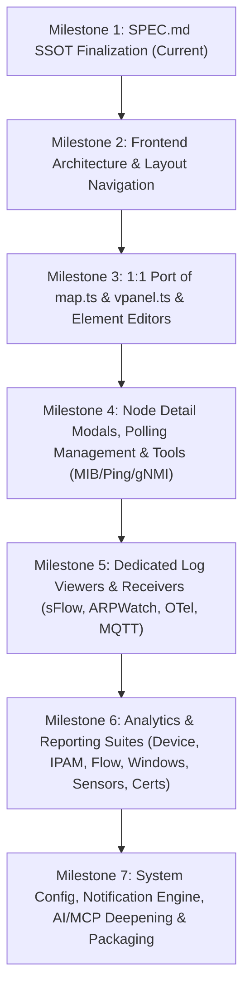

# TWSNMP NEO (twsnmpneo) Development Specification (SPEC.md)

This specification defines the architectural design, implementation requirements, and operational workflows for **TWSNMP NEO**, the unified modern successor to both the containerized network manager **TWSNMP FC** and the desktop edition **TWSNMP FK**.
Google Antigravity 2.0 must treat this document as the Single Source of Truth (SSOT) to autonomously drive implementation, testing, and deployment configurations.

---

## 1. Project Overview & Objectives

* **Project Name**: TWSNMP NEO
* **Container / Repository Name**: `twsnmpneo`
* **Successor Lineage**: Direct successor consolidating **TWSNMP FC** (Container/Web edition) and **TWSNMP FK** (Desktop/Rich-feature edition).
* **Core Objectives**:
  1. **Complete Tech Stack Modernization**: Overhaul legacy dependencies with a clean, high-performance Go 1.23+ backend and a Svelte 5 (Runes) + Vite + TypeScript frontend.
  2. **100% Visual & Operational Compatibility with `twsnmpfk` Map (`map.ts`)**:
     - Port the p5.js canvas rendering engine from `twsnmpfk/frontend/src/lib/map.ts` directly into TWSNMP NEO.
     - Preserve identical rendering and operational mechanics for:
       - **Nodes**: Standard icon fonts, custom uploaded image icons, alert blinking, state-colored glows, label positioning.
       - **Networks (ネットワーク / Network Port Panel)**: Graphical container representing a network (switching hub, router, subnet, managed or unmanaged network) on the map. Renders each port box with port image (`port.png`), Link UP/DOWN green/grey LED circles, port numbers/names, configurable horizontal wrap layout (`HPorts`), and serves as exact port-level connection endpoints (`getLinePos`) for connecting lines.
       - **Lines**: Node-to-node and node-to-network port connections, state colors, bandwidth utilization thickness, and packet-flow directional animations.
       - **Draw Items (All 11 Types)**: Text, Rectangles, Ellipses, Images, Polling Gauges, Classic Gauges, Bar Charts, Line Charts, and KPI Cards with real-time value binding.
       - **Interactions**: Drag & drop placement, multi-selection, zoom/pan navigation, background images, context menus (node edit, polling, MIB browser, Ping, etc.).
       - **Audio**: Sound alerts (warning beeps, Ping response sounds).
  3. **Direct Port of 3D Virtual Hardware Panel (`vpanel.ts`)**:
     - Port `twsnmpfk/frontend/src/lib/vpanel.ts` with p5.js WEBGL 3D canvas rendering for rack/chassis hardware panels.
     - Replicate 3D switch boxes, front RJ45 port textures, Link UP/Down green LEDs, Port Speed amber LEDs, rear LEDs, POWER blue LED, 3D orbit controls, auto-rotation, and configurable port wrapping.
  4. **Direct Port of Map Element Editors & Operational Dialogs**:
     - **Node Editor (`Node.svelte`)**: Edit name, IP, MAC, SNMP (v1/v2c/v3), icon, image icon, credentials, auto-detect (`NodeAutoDetectDialog`).
     - **Network Editor (`Network.svelte`)**: Edit CIDR, description, port configurations, LLDP, ARP watch, port definition import/export.
     - **Draw Item Editor (`DrawItem.svelte`)**: Configure text, shapes, images, real-time polling metric gauges, KPI cards, formatters, and dark/light previews.
     - **Line Editor (`Line.svelte`)**: Select connected nodes/networks, bind traffic polling metrics, line style, color, and width.
  5. **Complete Port of Analytics & Reporting Views**:
     - Replicate all reporting suites from TWSNMP FC & FK:
       - **Device Analytics**: LAN devices (MAC/Vendor/IP), Bluetooth devices, Wi-Fi Access Points, Switch FDB tables, Port tables.
       - **IPAM & IP Analytics**: Subnet utilization grids, IPv4 host inventory, IPv6 host inventory, host-to-host address relationship graphs, GeoIP.
       - **Flow & Traffic Analytics**: Top server ports, NetFlow/IPFIX flow statistics, Fumble flows (rejected/anomalous connections), packet type (Ethernet) distributions, DNS query analytics, RADIUS and TLS analytics.
       - **Host & Windows Analytics**: Windows Event IDs, Logon audits, Account alterations, Kerberos tickets, Privilege escalations, Process activity, Scheduled Tasks.
       - **IoT & Sensor Monitoring**: Environmental sensors (temperature/humidity), Power consumption meters, Motion detection sensors, SDR radio frequency signal levels, MQTT topics and clients.
       - **Security & Certificate Monitoring**: TLS/SSL server certificate expiration tracker, PKI certificate authority manager.
       - **AI Anomaly Detection**: AI anomaly scores across nodes, pollings, and log streams (`AIList`).
  6. **Diagnostic & Operational Tooling**:
     - **MIB Browser & Tree Explorer**: Real-time SNMP Get, GetNext, Walk, Table retrieval, and MIB hierarchy tree navigator.
     - **Real-time Ping Tool**: Continuous ICMP/UDP ping, response time graphs, packet size controls, and audio playback.
     - **gNMI Tool & Wake-on-LAN (WOL)**.
     - **Network Discovery Engine**: IP range scanning, concurrent ping/SNMP/ARP sweep, and bulk node registration.
  7. **Comprehensive Log Viewers & Storage**:
     - Full dedicated viewers for EventLog, Syslog, SNMP TRAP, NetFlow/IPFIX, sFlow, ARP Watch, and OpenTelemetry.
     - Powered by Apache Parquet columnar storage for lightning-fast queries, filtering, and automated disk rotation.
  8. **Native AI & MCP (Model Context Protocol) Integration**:
     - Multi-LLM orchestration via `tensai` (Gemini, OpenAI, Claude, Ollama).
     - Native built-in MCP server exposing system metrics, node topologies, logs, and diagnostic tools to external autonomous agents.
     - Inline AI assistance dialogs (Log diagnosis, polling assistance, node health diagnosis).
  9. **Full Single-Binary Packaging**:
     - Embed the complete Svelte 5 frontend into the Go executable via `embed.FS`.

---

## 2. Tech Stack & Environment

### 2.1 Backend (Go)
* **Language Version**: Go 1.23+
* **Data Storage**:
  * **bbolt**: System configuration, network maps, node/network/line/draw-item topologies, polling configurations, credentials, PKI, and event logs.
  * **Apache Parquet**: Syslog, SNMP TRAP, NetFlow/IPFIX, sFlow, and polling metric time-series logs (columnar compression, fast filtering, safe disk rotation).
* **AI & Agent Integrations**:
  * `tensai`: Multi-LLM client (Gemini, OpenAI, Claude, Ollama).
  * Built-in **MCP Server** (`github.com/modelcontextprotocol/go-sdk`): Tools for system health, nodes, alerts, logs, and diagnostics over SSE and Stdio.
* **Built-in Protocol Receivers & Servers**:
  * Syslog (UDP, TCP, TLS)
  * SNMP TRAP (v1, v2c, v3)
  * NetFlow v5 / v9 / IPFIX
  * sFlow v5 (Flow and Counter samples)
  * ARP Watch (Local subnet ARP monitoring, IP-MAC conflict detection)
  * OpenTelemetry (OTel OTLP receiver for traces and metrics)
  * Embedded MQTT Broker & Client
  * Private PKI (Certificate Authority, SCEP, ACME, OCSP)
* **Notifications**:
  * Email (SMTP / OAuth2), Slack, LINE, Microsoft Teams, Discord, Mattermost, Chatwork, and Webhooks.

### 2.2 Frontend (SPA)
* **Language / Framework**: Svelte 5 (Runes-based: `$state`, `$derived`, `$props`) + Vite + TypeScript
* **Map & 3D Panel Rendering**: **p5.js** (direct 1:1 port of `map.ts` and `vpanel.ts` from TWSNMP FK)
* **Charts & Telemetry**: **Apache ECharts** (multi-axis metric charts, traffic rates, response times, log histograms)
* **Styling & Components**: Tailwind CSS + `shadcn-svelte` / Bits UI + Lucide Icons + MDI Icons
* **Internationalization**: `svelte-i18n` (Japanese and English support)
* **Distribution**: Bundled into the final Go executable using `embed.FS`.

---

## 3. Directory Layout

```text
twsnmpneo/
├── .github/
│   └── workflows/
│       ├── test.yml              # CI: Backend tests (-race, coverage), Frontend typecheck/build
│       └── release.yml           # CD: Cross-compilation multi-arch binaries & GHCR container push
├── backend/
│   ├── cmd/
│   │   └── twsnmpneo/
│   │       └── main.go           # Application entrypoint & CLI flag parser
│   ├── internal/
│   │   ├── ai/                   # tensai multi-LLM client & built-in MCP server
│   │   ├── api/                  # REST API, WebSocket, and SSE endpoints
│   │   ├── datastore/
│   │   │   ├── bbolt/            # Document database (Nodes, Lines, Networks, DrawItems, Polling, etc.)
│   │   │   └── parquet/          # Columnar log store (Syslog, Trap, NetFlow, sFlow, Metrics)
│   │   ├── discover/             # Network discovery engine (Ping/SNMP/ARP sweep)
│   │   ├── importer/             # Legacy TWSNMP FC / FK database migration
│   │   ├── mib/                  # MIB module parser, OID tree resolver, SNMP Walk engine
│   │   ├── notify/               # Notification dispatchers (SMTP, Slack, Teams, LINE, Webhook)
│   │   ├── pki/                  # Private Root CA, TLS cert issuance, SCEP, ACME
│   │   ├── polling/              # Monitoring pollers (Ping, SNMP, HTTP, TCP, DNS, NTP, TLS, Script, gNMI)
│   │   ├── receiver/             # Ingestion servers (Syslog, TRAP, NetFlow, sFlow, OTel, MQTT, ARPWatch)
│   │   └── report/               # Aggregation engine (IPAM, Devices, Flows, Windows, Sensors, Certs)
│   └── web/                      # Embedded frontend static assets (web.go)
├── frontend/
│   ├── src/
│   │   ├── lib/
│   │   │   ├── components/       # Modals & UI controls
│   │   │   │   ├── NodeDialog.svelte         # Node editor (ports Node.svelte)
│   │   │   │   ├── NetworkDialog.svelte      # Network editor (ports Network.svelte)
│   │   │   │   ├── DrawItemDialog.svelte     # DrawItem editor (ports DrawItem.svelte)
│   │   │   │   ├── LineDialog.svelte         # Line editor (ports Line.svelte)
│   │   │   │   ├── PollingDialog.svelte      # Polling editor (ports AddPolling.svelte)
│   │   │   │   ├── NodeDetailModal.svelte    # Node detail (tabs: vpanel, ports, RMON, host, logs)
│   │   │   │   ├── ConfigModal.svelte        # System config (Map, Notify, AI, Icons, MIB, Store)
│   │   │   │   └── HelpDialog.svelte         # Contextual markdown help dialog
│   │   │   ├── views/            # Main navigation page views
│   │   │   │   ├── MapView.svelte            # Topology map view + bottom log drawer
│   │   │   │   ├── LocationView.svelte       # Geographic GIS map view (MapLibre)
│   │   │   │   ├── ListView.svelte           # Integrated inventory management (Node, Polling, Network, Line, DrawItem)
│   │   │   │   ├── DiscoverView.svelte       # Network discovery sweep
│   │   │   │   ├── LogView.svelte            # Comprehensive logs (Event, Syslog, Trap, Flow, sFlow, ARP, OTel)
│   │   │   │   ├── ReportView.svelte         # Analytics reports (Device, IPAM, Flow, Windows, Sensor, Cert, AI)
│   │   │   │   ├── ToolView.svelte           # Tools (MIB Browser, Ping, gNMI, WOL)
│   │   │   │   └── SystemView.svelte         # System status & metrics
│   │   │   ├── map/
│   │   │   │   ├── map.ts                    # Complete p5.js map engine (ported from twsnmpfk)
│   │   │   │   ├── vpanel.ts                 # Complete p5.js 3D WEBGL panel engine (ported from twsnmpfk)
│   │   │   │   └── chart/drawitem.ts         # Gauge, Bar, Line, and KPI card canvas renderers
│   │   │   ├── mcp/              # AI chat & MCP assistant panel
│   │   │   └── stores/           # Svelte 5 stores ($state) & API clients
│   │   ├── static/               # Device icons & sound files
│   │   ├── App.svelte            # Top navigation & active view router
│   │   └── main.ts
│   ├── package.json
│   └── vite.config.ts
├── Dockerfile                    # Multi-stage build (Node build -> Go build -> Minimal image)
├── docker-compose.yml
├── mise.toml                     # Local tooling & task definitions
├── SPEC.md                       # This specification file (SSOT)
└── README.md
```

---

## 4. Detailed Functional Requirements

### 4.1 UI Navigation & Layout Hierarchy
The application provides a top navbar (or collapsible sidebar) allowing users to switch between the following dedicated views:

1. **Map View (`MapView.svelte`)**:
   - Primary interactive topology canvas powered by `map.ts`.
   - Bottom real-time event log bar with expandable log drawer.
   - Quick node selection dropdown, zoom controls, full-screen map toggle, and refresh trigger.
2. **Location View (`LocationView.svelte`)**:
   - Geographic GIS map powered by MapLibre / OpenStreetMap displaying nodes plotted by coordinates (`Loc` property).
3. **List View (`ListView.svelte`)**:
   - Integrated inventory management view featuring a left sidebar category switcher matching `ReportView.svelte`.
   - Supports 5 resource categories: **Nodes**, **Pollings**, **Networks**, **Lines**, and **Draw Items**.
   - Includes real-time detection and safe deletion of orphaned lines (missing endpoints) and off-screen / non-interactable map items.
   - Integrates `NodeDialog`, `NodeDetailModal`, `PollingDialog`, `NetworkDialog`, `LineDialog`, and `DrawItemDialog`.
4. **Discovery View (`DiscoverView.svelte`)**:
   - IP range sweep input (CIDR/ranges), concurrent Ping/SNMP scan progress bar, discovered node table, and one-click node/polling generation.
5. **Log View (`LogView.svelte`)**:
   - Dedicated tabs for **EventLog**, **Syslog**, **SNMP TRAP**, **NetFlow / IPFIX**, **sFlow / sFlow Counter**, **ARP Watch**, and **OpenTelemetry**.
   - Features columnar filters, regex search, time range pickers, histogram visualization, CSV export, and inline AI troubleshooting (`LogAIDialog`).
6. **Report View (`ReportView.svelte`)**:
   - Grouped analytics suites:
     - **Device Analytics**: LAN devices, Bluetooth, Wi-Fi APs, Switch FDB tables, Port tables.
     - **IPAM & IP Analytics**: Subnet usage heatmaps, IPv4 list, IPv6 list, host communication graphs.
     - **Flow & Traffic Analytics**: Top server ports, Flows, Fumble flows, Ethernet types, DNS queries, RADIUS, TLS.
     - **Windows Analytics**: Event ID stats, Logon logs, Account events, Kerberos, Privilege access, Processes, Tasks.
     - **Sensor & IoT Analytics**: Environmental (temp/humidity), Power consumption, Motion sensors, SDR RF power, MQTT clients/topics.
     - **Security & Certs**: Server certificate expiration tracker, PKI CA inventory.
     - **AI Anomaly**: AI anomaly scores across nodes and pollings.
7. **Tool View (`ToolView.svelte`)**:
   - **MIB Browser**: MIB tree hierarchy, SNMP Walk/Table/Get query interface.
   - **Ping Tool**: Continuous Ping with real-time response time graph and sound alerts.
   - **gNMI Tool**: Capabilities, Get, and Subscribe explorer.
   - **WOL**: Wake-on-LAN magic packet dispatcher.
8. **Config View (`ConfigModal.svelte`)**:
   - Comprehensive multi-tab configuration: Map options, Notification credentials (Email, Slack, LINE, Teams, Webhook), AI credentials, Custom Icons, MIB Module manager, Grok pattern editor, and Datastore backup/restore/FC migration.
9. **System View (`SystemView.svelte`)**:
   - Host CPU/memory telemetry, internal daemon process health, version check, and licensing info.

---

### 4.2 Topology Map & Graphics Engine (`map.ts` Port)

* **Engine Core**: Direct port of `twsnmpfk/frontend/src/lib/map.ts` into TypeScript/Svelte 5.
* **Canvas Sizing**: Auto-responsive (e.g. 2500x5000 / 4093x2894) with dynamic scaling (`scale` from 0.05 to 3.0).
* **Node Rendering**:
  - State rendering: Normal (no glow), Low (amber glow/blink), High (red glow/blink), Unknown (grey).
  - Icons: Support Material Design Icons (MDI font code) and uploaded PNG/SVG custom icons from datastore.
  - Labels: Formatted node name, IP address, font scaling.
* **Network Node (ネットワーク / Network Port Panel)**:
  - Container box rendered with border and background representing managed/unmanaged networks (switches, routers, subnets).
  - Displays header with Network Name, error message or status.
  - Renders grid of ports with `port.png` texture, LED circle (green for UP, grey for DOWN), port number/name labels.
  - Line termination calculations (`getLinePos`) use specific port coordinates (`NET:<networkID>`) rather than center of container.
* **Lines (Connections)**:
  - Source-to-Destination drawing between nodes or between a node and a specific network port.
  - State color inheritance: Red for high, orange for low, blue/green for normal.
  - Dynamic line thickness and animated dash flow representing traffic bandwidth utilization.
* **Draw Items (All 11 Types)**:
  - `Type 0/1`: Basic Geometric Shapes (Rectangles, Ellipses).
  - `Type 2`: Text Box with font size, color, background opacity.
  - `Type 3`: Static Image / Diagram overlay.
  - `Type 4`: Container Box / Grouping border.
  - `Type 5`: Classic Polling Metric Gauge.
  - `Type 6`: Modern Radial Gauge (`gauge()` canvas renderer).
  - `Type 7`: Horizontal Bar Chart (`bar()` renderer).
  - `Type 8`: Sparkline Trend Chart (`line()` renderer).
  - `Type 11`: Modern KPI Card (`kpi()` renderer) with formatted numbers, subtitle, and sparkline.
* **Map Operations**:
  - Left-click drag to select and move nodes/items.
  - Mouse wheel zoom in/out.
  - Right-click context menu (Edit Node, Add Line, Node Detail, MIB Browser, Ping, Delete).
  - Background image loading with positioning and scaling.
  - Audio alert integration (`BeepHigh`, `BeepLow`).

---

### 4.3 3D Virtual Hardware Panel Engine (`vpanel.ts` Port)

* **Engine Core**: Direct port of `twsnmpfk/frontend/src/lib/vpanel.ts` using p5.js in WEBGL mode.
* **Chassis Rendering**: 3D extruded metal/dark box with dimensions calculated dynamically from total port count and `portWrap`.
* **Port Visuals**:
  - Front RJ45 port texture planes (`port.png`).
  - Link status LED: 3D sphere colored green (`#11ee00`) for UP, grey (`#999999`) for DOWN.
  - Port speed LED: 3D sphere colored amber (`#eeaa00`) for 1Gbps+, grey for 100Mbps/down.
  - Port sequence numbers embossed on front panel.
  - Rear LED duplicates and blue POWER status LED.
* **Interactive Camera**: Orbit controls (mouse rotation, pan, zoom), toggleable continuous rotation, zoom slider.

---

### 4.4 Map Element Editors

* **Node Editor (`NodeDialog.svelte`)**:
  - Input fields: Name, IP Address, MAC Address, Address Mode (IP/MAC), Icon selector, Custom Image icon selector, SNMP Version (v1/v2c/v3), Community, v3 User/Auth/Priv, SSH User/Key, URL, Location coordinate (lat,lng), AutoAck toggle.
  - Integration with `NodeAutoDetectDialog`: Automatic SNMP detection of sysName, sysDescr, interfaces, and suggested pollings.
* **Network Editor (`NetworkDialog.svelte`)**:
  - Input fields: Network Name, IP Address, Description, SNMP settings (v1/v2c/v3, Community, User, Password), URL, Unmanaged toggle.
  - Port layout configurations: Total Ports (e.g. 8, 16, 24, 48), Horizontal Port Wrap (`HPorts`), LLDP auto-detection toggle, ARP watch toggle.
  - Interactive Port Definitions Table: List of ports with ID, Name, State (up/down), bound Polling, X/Y offsets, and port definition import/export capabilities.
* **Draw Item Editor (`DrawItemDialog.svelte`)**:
  - Item Type selector (Text, Box, Shape, Image, Gauge, Bar, Line, KPI Card).
  - Data binding: Link item to specific Node and Polling Metric.
  - Formatting controls: Scale, decimal format, prefix/suffix units, color picker, dark/light mode preview.
* **Line Editor (`LineDialog.svelte`)**:
  - Selection of Node 1 and Node 2 (or Network).
  - Polling bindings: Associate polling metrics from both endpoints for bidirectional traffic line width and animation speed.
  - Custom color, width, and style (solid, dashed).

---

### 4.5 Node Detail & Telemetry Modal (`NodeDetailModal.svelte`)

* **Virtual Panel Tab**: Embedded 3D `vpanel` canvas for live port inspection.
* **Ports Tab**: Interface table (ifIndex, ifDescr, ifType, ifSpeed, ifOperStatus, inOctets, outOctets, error counters).
* **Host Resource Tab**: CPU utilization gauge, Memory usage, Storage partitions, Running processes table.
* **RMON Tab**: RMON Ethernet statistics (drop events, packets, broadcast, multicast, CRC align errors, collision counters).
* **Polling Tab**: List of active pollings for this node with manual run triggers and status editing.
* **Logs Tab**: Filtered log entries specifically for this node's IP (Syslog, Trap, NetFlow).
* **Diagnose Tab**: One-click health check (Ping test, SNMP connectivity check, Web port test).

---

### 4.6 Analytics & Reporting Engine (`report` package)

* **LAN & Device Report**:
  - Inventory of all detected MAC addresses resolved with IEEE OUI vendor database, associated IP, first seen timestamp, last seen timestamp.
* **IPAM Report**:
  - Subnet range heatmap showing used, free, and duplicate IP addresses.
* **Flow & Server Report**:
  - Ingest NetFlow / IPFIX / sFlow records into Parquet and summarize top communication pairs, top port numbers, bandwidth consumption over time.
  - Fumble Flow detection: Unanswered TCP SYN packets, connection resets, port scans.
* **Windows Analytics**:
  - Ingest Windows Event Logs via Syslog or WinRM.
  - Classify events: Logon successes/failures (Event 4624/4625), user creation/modification (4720/4726), privilege use (4672), scheduled tasks (4698), Kerberos ticket requests (4768/4769).
* **IoT & Environmental Monitoring**:
  - Temperature/humidity sensor time-series trends, threshold violation alarms.
  - Power consumption watt-hour tracking.
  - MQTT broker subscriber tracking and topic message inspection.
* **TLS Certificate Expiration Monitor**:
  - Automatic inspection of SSL/TLS certificates on port 443/custom ports.
  - Tracking of issuer, expiration date, remaining days, and automated alerts when expiration is within 30/14/7 days.

---

### 4.7 Operational Diagnostic Tools

* **MIB Browser**:
  - Embedded tree viewer for standard MIBs (RFC1213-MIB, HOST-RESOURCES-MIB, IF-MIB, RMON-MIB) and user-uploaded custom enterprise MIB files.
  - SNMP Get, GetNext, and Walk operations with formatted OID output, ASN.1 syntax translation, and raw hexadecimal decoding.
* **Ping Tool**:
  - Interactive continuous ping generator with customizable packet payload sizes, timeout intervals, response time histogram chart, and audible chime on packet loss/recovery.
* **gNMI Tool**:
  - Query gNMI capabilities and execute gNMI Get / Subscribe requests against modern network equipment.

---

### 4.8 Built-in Servers & Protocol Receivers

* **Syslog Receiver**: High-throughput UDP, TCP, and TLS ingestion with RFC3164 and RFC5424 parsing.
* **SNMP TRAP Receiver**: UDP receiver supporting SNMPv1, SNMPv2c, and SNMPv3 traps with MIB OID name resolution.
* **NetFlow / IPFIX Receiver**: UDP receiver parsing NetFlow v5, v9, and IPFIX packets, writing to Parquet logs.
* **sFlow Receiver**: UDP receiver parsing sFlow v5 Flow Samples and Counter Samples.
* **ARP Watch Engine**: Promiscuous ARP packet snooper detecting newly connected devices, IP address changes, and ARP spoofing / conflicts.
* **OpenTelemetry Receiver**: Ingest OTel metrics and traces via OTLP.
* **MQTT Broker & Client**: Embedded MQTT message broker for IoT sensor ingestion and rule evaluation.
* **Private PKI Engine**: Automated local Root CA, issuing server/client TLS certificates, with SCEP, ACME, and OCSP support.

---

### 4.9 AI & MCP (Model Context Protocol) Integration

* **Multi-LLM Orchestration**: Integrated `tensai` supporting OpenAI, Google Gemini, Anthropic Claude, and local Ollama instances.
* **MCP Server Implementation**:
  - Standard JSON-RPC 2.0 tools over SSE and Stdio.
  - Tools:
    - `get_system_status`: CPU, memory, uptime, receiver packet stats.
    - `list_nodes`: List all managed devices, IPs, MACs, and states.
    - `get_node_detail`: Properties, ports, MIB trees, polling history.
    - `get_active_alerts`: Active high/low alarm events.
    - `query_logs`: Columnar filter scan across Syslog, Trap, and NetFlow Parquet files.
    - `diagnose_node`: Run automated ping and diagnostic probes on demand.
* **UI AI Assist Dialogs**:
  - `LogAIDialog`: Submit log selections to LLM for root cause hypothesis and remediation suggestions.
  - `AIPollingAssistDialog`: Analyze SNMP MIB trees and automatically suggest optimal monitoring pollers.
  - `NodeDiagnoseDialog`: AI analysis of node connectivity and failure history.

---

## 5. Testing & Quality Policy

* **Coverage Requirement**: Maintain at least 80% statement and branch coverage across all Go backend packages (`internal/polling`, `internal/datastore`, `internal/importer`, `internal/receiver`, `internal/api`, `internal/report`, `internal/pki`, `internal/discover`).
* **Test Isolation**: Abstract network protocols, external agents, and LLM APIs behind mockable interfaces.
* **Race Detection**: All automated tests must pass cleanly with `go test -race ./...`.
* **Frontend Verification**: TypeScript strict mode, lint checks, and successful production asset bundle compilation.

---

## 6. Implementation Roadmap & Milestones

The project will proceed through the following phased milestones:



1. **Milestone 1: SPEC.md SSOT Finalization** (Completed in this step)
   - Update `SPEC.md` to comprehensively document all UI views, map mechanics, 3D panel, element editors, diagnostic tools, and reporting suites ported from TWSNMP FC and FK.
2. **Milestone 2: Frontend Navigation & Layout Foundation**
   - Replace the single-page dashboard with a top navbar / routing layout supporting all views (Map, Location, Node, Polling, Discover, Log, Report, Tool, Config, System).
   - Set up internationalization (`svelte-i18n`) and dark/light theme management.
3. **Milestone 3: 1:1 Port of `map.ts`, `vpanel.ts`, and Element Dialogs**
   - Port `map.ts` (nodes, networks, lines, all 11 draw items, animations, sound alerts).
   - Port `vpanel.ts` (3D WEBGL hardware rack rendering).
   - Port editors: `NodeDialog`, `NetworkDialog`, `DrawItemDialog`, `LineDialog`.
4. **Milestone 4: Node Detail, Polling Management & Operational Tools**
   - Implement `NodeDetailModal` (Virtual Panel, Ports, Host Resource, RMON, Polling, Logs, Diagnose).
   - Implement `PollingDialog` and time-series telemetry charts.
   - Implement `ToolView`: MIB Browser with MIB Tree explorer, Real-time Ping tool, gNMI tool, WOL.
   - Implement `DiscoverView` (Ping/SNMP sweep engine).
5. **Milestone 5: Dedicated Log Viewers & Protocol Receivers**
   - Implement dedicated views for EventLog, Syslog, SNMP TRAP, NetFlow, sFlow, ARP, OTel.
   - Implement sFlow v5 receiver and ARP Watch engine in backend.
   - Implement `LogAIDialog` for intelligent root-cause analysis.
6. **Milestone 6: Analytics & Reporting Suites**
   - Implement reporting views: Device inventory (OUI), IPAM, Server/Flow analysis, Fumble flows, Windows Event analytics, Environmental/Power sensors, TLS Certificate monitor, and AI anomaly list.
   - Backend aggregation pipelines for periodic reporting.
7. **Milestone 7: Configuration, Notification Engine, AI/MCP Deepening & Final Verification**
   - Implement `ConfigModal` (Map, Notify, AI, Icons, MIBs, Grok, Store).
   - Implement full notification dispatchers (Email, Slack, LINE, Teams, Webhook).
   - Expand built-in MCP server tools and AI chat capabilities.
   - Execute full test suites (`go test -race -cover ./...`), verify frontend build, and build self-contained Go binary.
