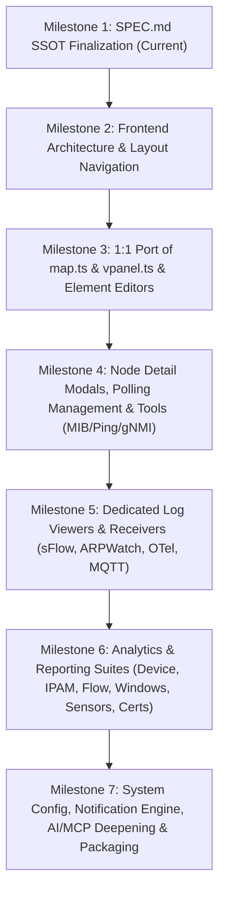

# TWSNMP NEO (twsnmpneo) Development Specification (SPEC.md)

This specification defines the architectural design, implementation requirements, and operational workflows for **TWSNMP NEO**, the unified modern successor to both the containerized network manager **TWSNMP FC** and the desktop edition **TWSNMP FK**.
Google Antigravity 2.0 must treat this document as the Single Source of Truth (SSOT) to autonomously drive implementation, testing, and deployment configurations.

---

## 1. Project Overview & Objectives

* **Project Name**: TWSNMP NEO
* **Container / Repository Name**: `twsnmpneo`
* **Successor Lineage**: Direct successor consolidating **TWSNMP FC** (Container/Web edition) and **TWSNMP FK** (Desktop/Rich-feature edition).
* **Core Objectives**:
  1. **Complete Tech Stack Modernization**: Overhaul legacy dependencies with a clean, high-performance Go 1.23+ backend and a Svelte 5 (Runes) + Vite + TypeScript frontend.
  2. **100% Visual & Operational Compatibility with `twsnmpfk` Map (`map.ts`)**:
     - Port the p5.js canvas rendering engine from `twsnmpfk/frontend/src/lib/map.ts` directly into TWSNMP NEO.
     - Preserve identical rendering and operational mechanics for:
       - **Nodes**: Standard icon fonts, custom uploaded image icons, alert blinking, state-colored glows, label positioning.
       - **Networks (ネットワーク / Network Port Panel)**: Graphical container representing a network (switching hub, router, subnet, managed or unmanaged network) on the map. Renders each port box with port image (`port.png`), Link UP/DOWN green/grey LED circles, port numbers/names, configurable horizontal wrap layout (`HPorts`), and serves as exact port-level connection endpoints (`getLinePos`) for connecting lines.
       - **Lines**: Node-to-node and node-to-network port connections, state colors, bandwidth utilization thickness, and packet-flow directional animations.
       - **Draw Items (All 11 Types)**: Text, Rectangles, Ellipses, Images, Polling Gauges, Classic Gauges, Bar Charts, Line Charts, and KPI Cards with real-time value binding.
       - **Interactions**: Drag & drop placement, multi-selection, zoom/pan navigation, background images, context menus (node edit, polling, MIB browser, Ping, etc.).
       - **Audio**: Sound alerts (warning beeps, Ping response sounds).
  3. **Direct Port of 3D Virtual Hardware Panel (`vpanel.ts`)**:
     - Port `twsnmpfk/frontend/src/lib/vpanel.ts` with p5.js WEBGL 3D canvas rendering for rack/chassis hardware panels.
     - Replicate 3D switch boxes, front RJ45 port textures, Link UP/Down green LEDs, Port Speed amber LEDs, rear LEDs, POWER blue LED, 3D orbit controls, auto-rotation, and configurable port wrapping.
  4. **Direct Port of Map Element Editors & Operational Dialogs**:
     - **Node Editor (`Node.svelte`)**: Edit name, IP, MAC, SNMP (v1/v2c/v3), icon, image icon, credentials, auto-detect (`NodeAutoDetectDialog`).
     - **Network Editor (`Network.svelte`)**: Edit CIDR, description, port configurations, LLDP, ARP watch, port definition import/export.
     - **Draw Item Editor (`DrawItem.svelte`)**: Configure text, shapes, images, real-time polling metric gauges, KPI cards, formatters, and dark/light previews.
     - **Line Editor (`Line.svelte`)**: Select connected nodes/networks, bind traffic polling metrics, line style, color, and width.
  5. **Complete Port of Analytics & Reporting Views**:
     - Replicate all reporting suites from TWSNMP FC & FK:
       - **Device Analytics**: LAN devices (MAC/Vendor/IP), Bluetooth devices, Wi-Fi Access Points, Switch FDB tables, Port tables.
       - **IPAM & IP Analytics**: Subnet utilization grids, IPv4 host inventory, IPv6 host inventory, host-to-host address relationship graphs, GeoIP.
       - **Flow & Traffic Analytics**: Top server ports, NetFlow/IPFIX flow statistics, Fumble flows (rejected/anomalous connections), packet type (Ethernet) distributions, DNS query analytics, RADIUS and TLS analytics.
       - **Host & Windows Analytics**: Windows Event IDs, Logon audits, Account alterations, Kerberos tickets, Privilege escalations, Process activity, Scheduled Tasks.
       - **IoT & Sensor Monitoring**: Environmental sensors (temperature/humidity), Power consumption meters, Motion detection sensors, SDR radio frequency signal levels, MQTT topics and clients.
       - **Security & Certificate Monitoring**: TLS/SSL server certificate expiration tracker, PKI certificate authority manager.
       - **AI Anomaly Detection**: AI anomaly scores across nodes, pollings, and log streams (`AIList`).
  6. **Diagnostic & Operational Tooling**:
     - **MIB Browser & Tree Explorer**: Real-time SNMP Get, GetNext, Walk, and Table retrieval; paginated table results with selectable page sizes; recent-query history and one-click common MIB objects; MIB hierarchy tree navigator.
     - **Real-time Ping Tool**: Continuous ICMP/UDP ping, response time graphs, packet size controls, and audio playback.
     - **gNMI Tool & Wake-on-LAN (WOL)**.
     - **Network Discovery Engine**: IP range scanning, concurrent ping/SNMP/ARP sweep, and bulk node registration.
  7. **Comprehensive Log Viewers & Storage**:
     - Full dedicated viewers for EventLog, Syslog, SNMP TRAP, NetFlow/IPFIX, sFlow, ARP Watch, and OpenTelemetry.
     - Powered by Apache Parquet columnar storage for lightning-fast queries, filtering, and automated disk rotation.
  8. **Native AI & MCP (Model Context Protocol) Integration**:
     - Multi-LLM orchestration via `tensai` (Gemini, OpenAI, Claude, Ollama).
     - Native built-in MCP server exposing system metrics, node topologies, logs, and diagnostic tools to external autonomous agents.
     - Inline AI assistance dialogs (Log diagnosis, polling assistance, node health diagnosis).
  9. **Full Single-Binary Packaging**:
     - Embed the complete Svelte 5 frontend into the Go executable via `embed.FS`.

---

## 2. Tech Stack & Environment

### 2.1 Backend (Go)
* **Language Version**: Go 1.23+
* **Data Storage**:
  * **bbolt**: System configuration, network maps, node/network/line/draw-item topologies, polling configurations, credentials, PKI, and event logs.
  * **Apache Parquet**: Syslog, SNMP TRAP, NetFlow/IPFIX, sFlow, and polling metric time-series logs (columnar compression, fast filtering, safe disk rotation).
* **AI & Agent Integrations**:
  * `tensai`: Multi-LLM client (Gemini, OpenAI, Claude, Ollama).
  * Built-in **MCP Server** (`github.com/modelcontextprotocol/go-sdk`): Tools for system health, nodes, alerts, logs, and diagnostics over SSE and Stdio.
* **Built-in Protocol Receivers & Servers**:
  * Syslog (UDP, TCP, TLS)
  * SNMP TRAP (v1, v2c, v3)
  * NetFlow v5 / v9 / IPFIX
  * sFlow v5 (Flow and Counter samples)
  * ARP Watch (Local subnet ARP monitoring, IP-MAC conflict detection)
  * OpenTelemetry (OTel OTLP receiver for traces and metrics)
  * Embedded MQTT Broker & Client
  * Private PKI (Certificate Authority, SCEP, ACME, OCSP)
* **Notifications**:
  * Email (SMTP / OAuth2), Slack, LINE, Microsoft Teams, Discord, Mattermost, Chatwork, and Webhooks.
* **Internationalization (i18n)**:
  * Backend localization package (`backend/internal/i18n`) powered by `github.com/jeandeaual/go-locale` for event logs, system resource alerts, and daemon lifecycle notifications.

### 2.2 Frontend (SPA)
* **Language / Framework**: Svelte 5 (Runes-based: `$state`, `$derived`, `$props`) + Vite + TypeScript
* **Map & 3D Panel Rendering**: **p5.js** (direct 1:1 port of `map.ts` and `vpanel.ts` from TWSNMP FK)
* **Charts & Telemetry**: **Apache ECharts** (multi-axis metric charts, traffic rates, response times, log histograms)
* **Styling & Components**: Tailwind CSS + `shadcn-svelte` / Bits UI + Lucide Icons + MDI Icons
* **Internationalization**: `svelte-i18n` (Japanese and English support)
* **Distribution**: Bundled into the final Go executable using `embed.FS`.

---

## 3. Directory Layout

```text
twsnmpneo/
├── .github/
│   └── workflows/
│       ├── test.yml              # CI: Backend tests (-race, coverage), Frontend typecheck/build
│       └── release.yml           # CD: Cross-compilation multi-arch binaries & GHCR container push
├── backend/
│   ├── cmd/
│   │   └── twsnmpneo/
│   │       └── main.go           # Application entrypoint & CLI flag parser
│   ├── internal/
│   │   ├── ai/                   # tensai multi-LLM client & built-in MCP server
│   │   ├── api/                  # REST API, WebSocket, and SSE endpoints
│   │   ├── datastore/
│   │   │   ├── bbolt/            # Document database (Nodes, Lines, Networks, DrawItems, Polling, etc.)
│   │   │   └── parquet/          # Columnar log store (Syslog, Trap, NetFlow, sFlow, Metrics)
│   │   ├── discover/             # Network discovery engine (Ping/SNMP/ARP sweep)
│   │   ├── importer/             # Legacy TWSNMP FC / FK database migration
│   │   ├── mib/                  # MIB module parser, OID tree resolver, SNMP Walk engine
│   │   ├── notify/               # Notification dispatchers (SMTP, Slack, Teams, LINE, Webhook)
│   │   ├── pki/                  # Private Root CA, TLS cert issuance, SCEP, ACME
│   │   ├── polling/              # Monitoring pollers (Ping, SNMP, HTTP, TCP, DNS, NTP, TLS, Script, gNMI)
│   │   ├── receiver/             # Ingestion servers (Syslog, TRAP, NetFlow, sFlow, OTel, MQTT, ARPWatch)
│   │   └── report/               # Aggregation engine (IPAM, Devices, Flows, Windows, Sensors, Certs)
│   └── web/                      # Embedded frontend static assets (web.go)
├── frontend/
│   ├── src/
│   │   ├── lib/
│   │   │   ├── components/       # Modals & UI controls
│   │   │   │   ├── NodeDialog.svelte         # Node editor (ports Node.svelte)
│   │   │   │   ├── NetworkDialog.svelte      # Network editor (ports Network.svelte)
│   │   │   │   ├── DrawItemDialog.svelte     # DrawItem editor (ports DrawItem.svelte)
│   │   │   │   ├── LineDialog.svelte         # Line editor (ports Line.svelte)
│   │   │   │   ├── PollingDialog.svelte      # Polling editor (ports AddPolling.svelte)
│   │   │   │   ├── NodeDetailModal.svelte    # Node detail (tabs: vpanel, ports, RMON, host, logs)
│   │   │   │   ├── ConfigModal.svelte        # System config (Map, Notify, AI, Icons, MIB, Store, BackImage)
│   │   │   │   ├── GridDialog.svelte         # Grid alignment dialog with live preview
│   │   │   │   ├── ImportMapModal.svelte     # Universal map importer (JSON & TWSNMP v4 .spm)
│   │   │   │   ├── FindNeighborDialog.svelte # Neighbor search and discovery dialog
│   │   │   │   └── HelpDialog.svelte         # Contextual markdown help dialog
│   │   │   ├── views/            # Main navigation page views
│   │   │   │   ├── MapView.svelte            # Topology map view + bottom log drawer
│   │   │   │   ├── LocationView.svelte       # Geographic GIS map view (MapLibre)
│   │   │   │   ├── ListView.svelte           # Integrated inventory management (Node, Polling, Network, Line, DrawItem)
│   │   │   │   ├── DiscoverView.svelte       # Network discovery sweep
│   │   │   │   ├── LogView.svelte            # Comprehensive logs (Event, Syslog, Trap, Flow, sFlow, ARP)
│   │   │   │   ├── OTelView.svelte           # Dedicated OpenTelemetry metrics, traces, and DAG viewer
│   │   │   │   ├── MQTTView.svelte           # Dedicated MQTT topic statistics, reports, and log viewer
│   │   │   │   ├── ReportView.svelte         # Analytics reports (Device, IPAM, Flow, Windows, Sensor, Cert, AI)
│   │   │   │   ├── PKIView.svelte            # PKI Certificate Authority & SCEP server view
│   │   │   │   └── SystemView.svelte         # System status & metrics
│   │   │   ├── map/
│   │   │   │   ├── map.ts                    # Complete p5.js map engine (ported from twsnmpfk)
│   │   │   │   ├── vpanel.ts                 # Complete p5.js 3D WEBGL panel engine (ported from twsnmpfk)
│   │   │   │   └── chart/drawitem.ts         # Gauge, Bar, Line, and KPI card canvas renderers
│   │   │   └── stores/           # Svelte 5 stores ($state) & API clients
│   │   ├── static/               # Device icons & sound files
│   │   ├── App.svelte            # Top navigation & active view router
│   │   └── main.ts
│   ├── package.json
│   └── vite.config.ts
├── Dockerfile                    # Multi-stage build (Node build -> Go build -> Minimal image)
├── docker-compose.yml
├── mise.toml                     # Local tooling & task definitions
├── SPEC.md                       # This specification file (SSOT)
└── README.md
```

---

## 4. Detailed Functional Requirements

### 4.1 UI Navigation & Layout Hierarchy
The application provides a top navbar (or collapsible sidebar) allowing users to switch between the following dedicated views:

1. **Map View (`MapView.svelte`)**:
   - Primary interactive topology canvas powered by `map.ts`.
   - Bottom real-time event log bar with expandable log drawer.
   - Quick node selection dropdown, zoom controls, full-screen map toggle, and refresh trigger.
   - Comprehensive blank area right-click context menu: Add node, Add draw item, New Network, Add Line, Check all pollings, Discover neighbors, Auto Layout submenu (Hierarchical, Cluster, Categorized, Grid alignment, Undo), Edit mode toggle (with locked interactions when disabled), and Node Info toggle.
   - Background image configuration via `ConfigModal.svelte` featuring natural dimension detection, aspect ratio locking, scaled miniature canvas placement preview, and immediate live reload without manual browser refresh.
   - Map import capability via `ImportMapModal.svelte` supporting both JSON and legacy TWSNMP v4 `.spm` formats with automatic encoding detection (Shift-JIS & UTF-8).
2. **Location View (`LocationView.svelte`)**:
   - Geographic GIS map powered by MapLibre / OpenStreetMap displaying nodes plotted by coordinates (`Loc` property).
3. **List View (`ListView.svelte`)**:
   - Integrated inventory management view featuring a left sidebar category switcher matching `ReportView.svelte`.
   - Supports 5 resource categories: **Nodes**, **Pollings**, **Networks**, **Lines**, and **Draw Items**.
   - Every category table supports sorting and pagination with selectable page sizes.
   - Includes real-time detection and safe deletion of orphaned lines (missing endpoints) and off-screen / non-interactable map items.
   - Integrates `NodeDialog`, `NodeDetailModal`, `PollingDialog`, `NetworkDialog`, `LineDialog`, and `DrawItemDialog`.
4. **Discovery View (`DiscoverView.svelte`)**:
   - IP range sweep input (CIDR/ranges), concurrent Ping/SNMP scan progress bar, discovered node table, and one-click node/polling generation.
5. **Log View (`LogView.svelte`)**:
   - Dedicated tabs for **EventLog**, **Syslog**, **SNMP TRAP**, **NetFlow / IPFIX**, **sFlow / sFlow Counter**, and **ARP Watch**.
   - Features columnar filters, regex search, time range pickers, histogram visualization, CSV export, and inline AI troubleshooting (`LogAIDialog`).
6. **OpenTelemetry View (`OTelView.svelte`)**:
   - Dedicated telemetry viewer featuring a left sidebar (`w-60`) for switching between **Metrics**, **Traces**, and **Logs** with real-time badge counts.
   - Top overview dashboard (`h-64`) featuring 4 vertical KPIs, metric type donut chart, service metric horizontal bar chart, and trace duration scatter plot.
   - Interactive service DAG topology graph, span hierarchy timeline tree, and fully sortable tables.
7. **MQTT View (`MQTTView.svelte`)**:
   - Dedicated MQTT topic monitor featuring a left sidebar (`w-60`) for switching between **統計 (Stats)** and **ログ (Logs)** with real-time badge counts.
   - Top overview dashboard (`h-64`) with 4 vertical KPIs, State breakdown donut chart, and Top 10 topics horizontal bar chart.
   - Top header action bar (Reload, Create Polling / AI Assist, Report, Delete All, Delete) and per-row topic copy button.
   - Full column sorting, standardized state badges (colored dot + badge tag), and pretty-printed payload code block.
   - Fully theme-adaptive 7-tab MQTT analytics report modal (`MQTTReportModal.svelte`) and independent Parquet logs (`type: mqtt`) with date filtering and automatic rotation.
8. **Report View (`ReportView.svelte`)**:
   - Analytics suites (powered by backend real-time aggregation engine `logreport.Engine` / `Reporter` pipeline, aligned with TWSNMP FC):
     - **Device Analytics**: LAN devices, Bluetooth, Wi-Fi APs, Switch FDB tables, Port tables.
     - **IPAM & IP Analytics**: Multi-subnet address heatmap (ECharts aggregated blocks with drilldown), IPv4 inventory, IPv6 inventory, host communication graphs.
     - **Polling Availability (SLA)**: Polling SLA stats, response times, and failure rates.
     - **Event Log Analytics**: Aggregated event logs categorized by event type, severity level, and associated nodes, including breakdown and trend analytics.
     - **Syslog Analytics**: Aggregated Syslog messages categorized by source host, application tag, facility, and severity level via real-time `SyslogStatsSummary`.
     - **SNMP TRAP Analytics**: Aggregated SNMP TRAP messages categorized by source, trap type, enterprise, and severity level via real-time `TrapStatsSummary`.
     - **NetFlow Analytics**: Top server ports, Conversations, Servers, Fumble flows, Protocols, with deviation scores (mean 50, sd 10) and penalty badges.
     - **sFlow Analytics**: Sampled flow and counter aggregation with Conversations, Servers, Fumble flows, and deviation scores.
     - **ARP Watch Analytics**: Aggregated ARP monitoring events categorized by IP/node, vendor, state (new device/MAC change), and severity level.
     - **Environmental Sensors (環境センサー)**: Tabbed analytics suite (`SensorReport.svelte`) for IoT & environmental sensors parsed from `twBlueScan` syslog:
       - **環境センサー (`envMonitor`)**: OMRON, SwitchBot, Inkbird (temperature, humidity, illuminance, barometric pressure, sound, eTVOC, eCO2, battery).
       - **電力センサー (`powerMonitor`)**: SwitchBot Plug Mini (power load W, switch ON/OFF, overload alert).
       - **人感センサー (`motionSensor`)**: SwitchBot Motion Sensor (motion detection, ambient light, battery, last move time).
       - Includes real-time signal strength (RSSI), interactive ECharts historical trend charts, multi-sensor comparison charts, sensor renaming, individual deletion, and CSV export. Radio power (twSdrPower) is unsupported.
     - **Security & Certs**: Server certificate expiration tracker, PKI CA inventory.
     - **AI Anomaly**: AI anomaly score reporting strictly aligned with TWSNMP FK (`AIList`). Displays pollings configured with log mode "異常検知あり" (`LogMode == LogModeAI`). Polling editor supports algorithm selection (`iforest`, `zscore`, `lof`, `knn`, `mahalanobis`, `hotelling`, `autoencoder`, `lstm`) and vector feature columns (`VectorCols`). Table presents Anomaly score with severity emoticon icon, Node Name, Polling, Count, and Last time. Supports row selection, Heatmap/Pie/Time analytics report modal (`AIReportModal`), feature DataFrame CSV export (`/api/ai/export/:id`), and result clearing.
     - **Anomaly Detection & Alert Integration**: Periodic evaluation of entity scores and Fumble counts; triggers `EventLogEnt` (Level: "warn", Type: "report") with 1-hour duplicate suppression when deviation score drops below `ScoreThreshold` or fumble count exceeds `FumbleThreshold`.
9. **PKI & Certificate View (`PKIView.svelte`)**:
   - Certificate Authority (CA) status, certificate issuance inventory, and SCEP management.
   - Diagnostic tools (Ping, MIB Browser, gNMI, WOL) are launched as modals from Map context menu & NodeDetailModal.
10. **System View (`SystemView.svelte`)**:
   - Fully compatible with TWSNMP FK resource monitor.
   - Top status summary cards: CPU utilization, Memory usage, Goroutines, Disk usage, Process Uptime, and Build/Git version.
   - ECharts multi-metric time-series telemetry charts (CPU, Memory, Goroutines, Disk I/O & Capacity).
   - Internal daemon services health, receiver packet/message counters, and runtime version details.
11. **Header Utility Bar & System Config (`ConfigModal.svelte`)**:
   - System settings button is located as an icon-only button on the top-right header utility bar.
   - The sidebar separates Map Settings, Polling Settings, and Database settings, alongside receivers, notifications, AI / LLM, and MIB management. Map options (name, size, icons, background image, and import), polling/SNMP parameters, and GeoIP, event-log retention, and datastore settings each have dedicated panels.
   - **Report Settings**: Configures Report Retention Days (`ReportDays`, default: 30), Max Report Entries (`ReportLimit`, default: 10000), Low Score Alert Threshold (`ScoreThreshold`, default: 35.0), and Fumble Alert Threshold (`FumbleThreshold`, default: 10) directly within the Database configuration tab.
   - OAuth2 mail-provider redirect URIs use `https://<public-host>/api/notify/oauth2/callback` (HTTP is allowed only for localhost) and must be registered with the provider. SMTP and webhook tests may connect to local/private servers; link-local and metadata service addresses are rejected.

---

### 4.2 Topology Map & Graphics Engine (`map.ts` Port)

* **Engine Core**: Direct port of `twsnmpfk/frontend/src/lib/map.ts` into TypeScript/Svelte 5.
* **Canvas Sizing**: Auto-responsive (e.g. 2500x5000 / 4093x2894) with dynamic scaling (`scale` from 0.05 to 3.0).
* **Node Rendering**:
  - State rendering: Normal (no glow), Low (amber glow/blink), High (red glow/blink), Unknown (grey).
  - Icons: Support Material Design Icons (MDI font code) and uploaded PNG/SVG custom icons from datastore.
  - Labels: Formatted node name, IP address, font scaling.
* **Network Node (ネットワーク / Network Port Panel)**:
  - Container box rendered with border and background representing managed/unmanaged networks (switches, routers, subnets).
  - Displays header with Network Name, error message or status.
  - Renders grid of ports with `port.png` texture, LED circle (green for UP, grey for DOWN), port number/name labels.
  - Line termination calculations (`getLinePos`) use specific port coordinates (`NET:<networkID>`) rather than center of container.
* **Lines (Connections)**:
  - Source-to-Destination drawing between nodes or between a node and a specific network port.
  - State color inheritance: Red for high, orange for low, blue/green for normal.
  - Dynamic line thickness and animated dash flow representing traffic bandwidth utilization.
* **Draw Items (All 11 Types)**:
  - `Type 0/1`: Basic Geometric Shapes (Rectangles, Ellipses).
  - `Type 2`: Text Box with font size, color, background opacity.
  - `Type 3`: Static Image / Diagram overlay.
  - `Type 4`: Container Box / Grouping border.
  - `Type 5`: Classic Polling Metric Gauge.
  - `Type 6`: Modern Radial Gauge (`gauge()` canvas renderer).
  - `Type 7`: Horizontal Bar Chart (`bar()` renderer).
  - `Type 8`: Sparkline Trend Chart (`line()` renderer).
  - `Type 11`: Modern KPI Card (`kpi()` renderer) with formatted numbers, subtitle, and sparkline.
* **Map Operations**:
  - Left-click drag to select and move nodes/items.
  - Mouse wheel zoom in/out, strict boundary clamping, and top-right pinned reload control.
  - Node right-click operations aligned strictly with `twsnmpfk`: report, PING, MIBブラウザー, gNMIツール, Wake On Lan, 編集, ポーリング, 再確認, 接続先を探す, コピー, 削除, and configured URL open.
  - Dedicated full-featured dialogs ported from `twsnmpfk`: `PingDialog` (Normal, Smoke, Trace, and MTR modes with realtime response charts, hop flow diagrams, and statistics), `MIBBrowserDialog` (hierarchical MIB tree selector, SNMP Get/GetNext/Walk/Table queries, and polling generation), and `GNMIToolDialog` (gNMI capabilities, path Get queries, and polling generation).
  - SW-HUB right-click menu aligned with `twsnmpfk`: report, immediate recheck, PING, SNMP MIB Browser, neighbor discovery, network editing, port-line editing, and deletion.
  - SW-HUB reports summarize configured ports and connected lines; unmanaged networks recheck by PING and managed networks recheck port state via SNMP.
  - Shift-click on nodes/network endpoints for interactive line creation, modification, and disconnection (`LineDialog`).
  - Network (SW-HUB) context menu action for batch port line management (`NetworkLinesDialog`).
  - Network and Node context menu action for topology discovery to detect and auto-connect neighbors (`FindNeighborDialog`, `/api/topology/neighbors/:id`, `/api/topology/connect-lines`).
  - Automatic deletion cascading: deleting a node automatically removes associated pollings, connected lines, and cleans up orphaned entries across datastore.
  - Background image loading with positioning and scaling.
  - Audio alert integration (`BeepHigh`, `BeepLow`).

---

### 4.3 3D Virtual Hardware Panel Engine (`vpanel.ts` Port)

* **Engine Core**: Direct port of `twsnmpfk/frontend/src/lib/vpanel.ts` using p5.js in WEBGL mode.
* **Chassis Rendering**: 3D extruded metal/dark box with dimensions calculated dynamically from total port count and `portWrap`.
* **Port Visuals**:
  - Front RJ45 port texture planes (`port.png`).
  - Link status LED: 3D sphere colored green (`#11ee00`) for UP, grey (`#999999`) for DOWN.
  - Port speed LED: 3D sphere colored amber (`#eeaa00`) for 1Gbps+, grey for 100Mbps/down.
  - Port sequence numbers embossed on front panel.
  - Rear LED duplicates and blue POWER status LED.
* **Interactive Camera**: Orbit controls (mouse rotation, pan, zoom), toggleable continuous rotation, zoom slider.

---

### 4.4 Map Element Editors

* **Node Editor (`NodeDialog.svelte`)**:
  - Input fields: Name, IP Address, MAC Address, Address Mode (`ip`=固定IP / `mac`=固定MAC / `host`=ホスト名), Icon selector, Custom Image icon selector, SNMP Version (v1/v2c/v3), Community, v3 User/Auth/Priv, SSH User/Key, URL, Location coordinate (lat,lng), AutoAck toggle.
  - **Address Mode Handling (`twsnmpfk` parity)**:
    - `ip` (Fixed IP): Static IP address, MAC is populated or monitored from ARP table.
    - `mac` (Fixed MAC): Tracks and updates node IP address when device changes IP in local ARP table.
    - `host` (Host Name): Node Name is treated as hostname. Resolves IP via DNS lookup upon save and periodic ARP/Host checks. IP input field is optional in this mode.
  - **No Automatic Polling on Creation**: Nodes are added without implicitly generating default ping pollings. Pollings are managed explicitly by user or auto-detection.
  - **Node State Aggregation**: Node state is aggregated across all active pollings (`Level != "off"`) with severity priority `high` > `low` > `warn` > `repair` > `normal` > `unknown`. Pollings with `Level = "off"` (停止) are excluded from node state calculations and do not trigger node severity alarms.
  - Integration with `NodeAutoDetectDialog`: Automatic SNMP detection of sysName, sysDescr, interfaces, and suggested pollings.
* **Network Editor (`NetworkDialog.svelte`)**:
  - Input fields: Network Name, IP Address, Description, SNMP settings (v1/v2c/v3, Community, User, Password), URL, Unmanaged toggle.
  - Port layout configurations: Total Ports (e.g. 8, 16, 24, 48), Horizontal Port Wrap (`HPorts`), LLDP auto-detection toggle, ARP watch toggle.
  - Interactive Port Definitions Table: List of ports with ID, Name, State (up/down), bound Polling, X/Y offsets, and port definition import/export capabilities.
* **Draw Item Editor (`DrawItemDialog.svelte`)**:
  - Item Type selector (Text, Box, Shape, Image, Gauge, Bar, Line, KPI Card).
  - Data binding: Link item to specific Node and Polling Metric.
  - Formatting controls: Scale, decimal format, prefix/suffix units, color picker, dark/light mode preview.
* **Line Editor (`LineDialog.svelte`)**:
  - Selection of Node 1 and Node 2 (or Network).
  - Polling bindings: Associate polling metrics from both endpoints for bidirectional traffic line width and animation speed.
  - Custom color, width, and style (solid, dashed).

* **Polling Definition & Multi-Protocol Parity (23 Polling Types)**:
  - Persist the shared `PollingEnt` configuration used by TWSNMP FK: `Mode`, `Params`, `Filter`, `Extractor`, `Script`, `Level`, `PollInt`, `Timeout`, `Retry`, `LogMode`, `FailAction`, `RepairAction`, `AIMode`, `VectorCols`, `MqttURL`, `MqttTopic`, and `MqttCols`.
  - The polling editor exposes these shared fields and retains FK field names in the API/data model. Polling scheduling, execution orchestration, and the `Poller` interface remain NEO-owned.
  - Complete support for all 23 polling types from TWSNMP FK:
    1. **PING (`ping`)**: ICMP/UDP echo polling. Uses the selected node's IP and supports FK's default mode, `line`, and `smoke` modes. `Params` supports legacy numeric payload size and `size`, `ttl`, and (for `smoke`) `count` options. Nanosecond RTT values, failure level selection, smoke statistics, and smoke-mode JavaScript boolean state evaluation are compatible with FK.
    2. **SNMP (`snmp`)**: Full parity with TWSNMP FK across all 9 modes and SNMPv3 security parameters (`v1`, `v2c`, `v3auth`, `v3authpriv`, `v3authprivex`, `v3sha256aes128`, `v3sha512aes256`):
       - `get` / `(default)`: Multi-OID GET queries with `delta` and `ps` (per-second rate) computation, string filter matching, and Otto JavaScript scripting.
       - `sysUpTime`: System uptime polling with wrap/reboot detection and `deltaSysUpTime` calculation.
       - `ifOperStatus`: Interface operational status check (`ifOperStatus.<idx>` / `ifAdminStatus.<idx>`).
       - `traffic`: Ingress/egress bandwidth calculation (`bps`, `obps`, `pps`, `opps`, `bytes`, `outBytes`, `errors`) using 32-bit and 64-bit HC counters from `ifXTable`.
       - `count`: Table Walk with regex filter count and Otto boolean evaluation.
       - `process`: Host resource process polling (`hrSWRunName`) with PID summation to detect process restarts/changes.
       - `stats`: Numeric MIB table Walk computing `count`, `sum`, and `avg`.
       - `hrSystemDate`: RFC 2579 DateAndTime parsing with clock drift calculation (`diff` in seconds) and Otto scripting.
       - `script`: Free-form Otto JavaScript polling injecting a callable `snmpGet(oidName)` function.
    3. **gNMI (`gnmi`)**: OpenConfig gNMI telemetry polling via `github.com/openconfig/gnmic/pkg/api` (`get` and `subscribe` streaming modes) with target authentication and JSON path/XPath data extraction.
    4. **TCP (`tcp`)**: Plain TCP socket connectivity check with optional banner capture and regex pattern matching.
    5. **HTTP / HTTPS (`http`)**: Web service polling with support for `hash` mode (SHA256 response body change detection), `metrics` mode (Apache, Nginx, Fiber JSON metrics parsing), and Otto JavaScript scripting with full HTTP context (`status`, `code`, `rtt`, `interval`).
    6. **TLS (`tls`)**: TLS certificate check supporting modes `verify` (valid certificate chain), `version` (TLS protocol version restriction), `expire` (remaining days threshold verification), and `cert` (dedicated server certificate monitoring report with full attributes: issuer, subject, serialNumber, start/end dates, remaining days, key strength, and state evaluated against configured polling Level). Populates FK-compatible fields (`rtt`, `version`, `cipherSuite`, `valid`, `issuer`, `subject`, `notAfter`, `notBefore`, `serialNumber`, `days`, `key`).
    7. **DNS (`dns`)**: Supports record resolution types (`ipaddr`, `addr`, `host`, `mx`, `ns`, `txt`, `cname`). In `ipaddr` mode, automatically detects IP address changes across polling runs. Evaluates JavaScript boolean expressions via Otto VM in other modes.
    8. **NTP (`ntp`)**: Uses `beevik/ntp` to query target servers and populates `rtt`, `stratum`, `refid`, and clock `offset` in nanoseconds, matching FK fields.
    9. **Syslog (`syslog`)**: Log monitoring over indexed log stores. Modes: `count` (matching message frequency), `pri` (facility/severity filtering), `stats` (message volume aggregation), and `sigma` (automated Sigma rule threat detection evaluating critical/high security matches).
    10. **SNMP TRAP (`trap`)**: Trap log reception monitoring over indexed trap stores (`count` and `stats` modes).
    11. **ARP Log (`arplog`)**: ARP inspection log monitoring for new/changed IP-MAC associations (`count` and `stats` modes).
    12. **NetFlow (`netflow`)**: Flow record monitoring over indexed NetFlow stores. Modes: `traffic` (bytes/packets per second), `count` (flow count), and `stats` with source, destination, port, and protocol filters.
    13. **Command (`cmd`)**: Executes local OS shell commands with `$IP` and `$NODE` template variable substitution, timeout bounds, and Otto evaluation of `exitCode`, `lastTime`, and extracted variables.
    14. **SSH (`ssh`)**: Remote execution over SSH with user/password or public key authentication, host key handling, timeout enforcement, and Otto script evaluation.
    15. **Report (`report`)**: Polling based on traffic and anomaly report metrics.
    16. **TWSNMP (`twsnmp`)**: Queries remote TWSNMP instances via `/mobile/api/mapstatus`, handles Basic Auth, and maps overall status and counts (`high`, `warn`, `low`, `normal`, `repair`, `dbsize`).
    17. **TwLogEye (`twlogeye`)**: Integration with TwLogEye log analysis daemon for log query counts and statistical thresholding.
    18. **Pi-Hole (`pihole`)**: Queries Pi-Hole DNS ad-blocker API, monitoring blocked queries, domain lists, and ad blocking percentage.
    19. **LXI (`lxi`)**: Scientific and industrial test instrumentation polling over SCPI raw TCP socket (port 5025). Exposes `lxiCommand(cmd)` and `lxiQuery(cmd)` built-in functions inside Otto VM scripts.
    20. **Monitor (`monitor`)**: Gathers local host resource telemetry (CPU, Memory, Disk, Load, Network, Goroutines, Heap) via `monitor.Monitor` and supports Otto JavaScript threshold scripting.
    21. **MQTT (`mqtt`)**: Connects to MQTT brokers (plain TCP or TLS), verifying broker availability and topic subscription metrics via JavaScript scripts.
    23. **STUN (`stun`)**: Discovers mapped public IP, external port, and local socket via `internal/stun` (UDP4/UDP6). Tracks external IP changes and supports Otto VM evaluation.

* **Otto JavaScript VM Script Engine & Built-in Functions**:
  - Full compatibility with TWSNMP FK script execution engine:
    - `setResult(name, value)`: Dynamically writes or updates metric values into `pe.Result` and makes them available to both the Otto VM and subsequent polling evaluations.
    - `getResult(name)`: Retrieves the current value or previously stored value of a metric.
    - `setLevel(level)`: Dynamically overrides the polling status level (`"normal"`, `"repair"`, `"warn"`, `"low"`, `"high"`, `"info"`, `"off"`).
    - Historical Metrics (`<key>_last`): All metrics from the previous polling run are automatically bound with the `_last` suffix (e.g. `load_last`, `rtt_last`, `bytes_last`) for rate and delta computations.
    - Interval variables: `interval` and `iterval` (legacy FK compatibility) set to `pe.PollInt` in seconds.
    - Extractor Pattern & Body Helpers: `internal/extractor` provides `getBody()` (raw body string), `jsonpath(path)` (JSONPath queries), and `goquery(selector)` (HTML CSS selector queries), alongside Grok named capture patterns.
    - Protocol Helpers: Injected functions for specialized pollers such as `snmpGet(oidName)`, `lxiCommand(cmd)`, and `lxiQuery(cmd)`.

* **Polling Template System & Auto-Deployment**:
  - **Embedded Bilingual Templates**: Built-in template repository loaded from embedded JSON files (`polling_ja.json` and `polling_en.json`).
  - **Template Endpoints**:
    - `GET /api/polling/templates?lang=ja`: Lists all available monitoring templates.
    - `GET /api/polling/template/:id?lang=ja`: Fetches detailed configuration of a single template.
    - `POST /api/polling/auto`: Batch-generates polling instances from a template for a given node.
    - `POST /api/polling/autogrok`: Automatically infers Grok extraction patterns from sample log text.
  - **AutoParam Interface Expansion**:
    - When a template defines `AutoParam == "ifIndex"`, the backend performs an SNMP walk on the target node (`ifType`, `ifName`, `ifDescr`) to discover active physical interfaces and generates dedicated polling instances for each interface (e.g. traffic or status per port), substituting `$i` in parameters with the interface index.
  - **Frontend Template Selector (`PollingTemplateDialog.svelte`)**:
    - Accessible directly from `ListView.svelte` and `MapView.svelte` ("テンプレートから追加" button).
    - Features keyword search, protocol type filtering, side-by-side template detail preview, single-template application, and batch auto-deployment across interfaces.

---

### 4.5 Node Detail & Telemetry Modal (`NodeDetailModal.svelte`)

* **Window Sizing & Layout**:
  - Horizontal landscape modal layout (`w-full max-w-6xl h-[88vh]` or `max-w-7xl`) tailored for wide multi-column data visualization and side-by-side inspection, matching `twsnmpfk` layout aesthetics.
* **Tabs & Specifications**:
  1. **Basic Info Tab (`基本情報 / Basic Info`)**:
     - Key-value item list (Node Name, State badge, IP Address, MAC Address with one-click copy button and feedback indicator, Vendor name, Description, Coordinates, Auto-Ack).
  2. **Virtual Panel Tab (`パネル / Panel`)**:
     - Embedded 3D `vpanel` canvas for live port inspection with auto-rotation toggle and zoom in/out controls.
     - **SNMP-Not-Supported Detection**: If SNMP is not configured on the node (`snmp_mode` is none/empty), the modal must explicitly display an informative amber alert card (`nodeDetail.snmpNotSupportedTitle` / `nodeDetail.snmpNotSupportedDesc`) rather than an empty, black, or hanging canvas.
  3. **Ports Tab (`ポート / Ports`)**:
     - SNMP interface port table (Port name, Link Status badge, Link Speed, Ingress Rx bytes, Egress Tx bytes).
     - Full column sorting (ascending/descending) and table pagination controls.
     - If SNMP is not configured, displays the SNMP-not-supported alert card.
  4. **Polling Tab (`ポーリング / Polling`)**:
     - Full tabular list displaying all pollings configured for this node (State, Name, Type, Target, Last Value, Last Time).
     - Standardized column sorting, pagination controls, and compact vertical row spacing matching `ListView.svelte`.
  5. **Event Log Tab (`イベントログ / Event Log`)**:
     - Tabular list of historical event logs filtered for this node (Time, Level, Type, Event Message).
     - Column sorting, pagination controls, compact row spacing, and non-breaking single-line timestamps (`whitespace-nowrap font-mono`) to prevent unwanted multiline wrapping.
  6. **Host Resource Tab (`ホストリソース / Host Resource`)**:
     - Sub-tab navigation for **System**, **Storage**, **Device**, **File System**, and **Process**.
     - Full column sorting, pagination controls, compact row spacing, and SNMP-not-supported handling.
  7. **RMON Tab**: RMON Ethernet statistics (drop events, packets, broadcast, multicast, CRC align errors, collision counters).
  8. **Diagnose Tab**: One-click health check (Ping test, SNMP connectivity check, Web port test).

---

### 4.6 Analytics & Reporting Engine (`report` package)

* **LAN & Device Report**:
  - Inventory of all detected MAC addresses resolved with IEEE OUI vendor database, associated IP, first seen timestamp, last seen timestamp.
* **IPAM Report**:
  - Multi-subnet address inventory supporting user-defined CIDR blocks and IP ranges.
  - Large-scale IP heatmap powered by Apache ECharts using hierarchical block aggregation and click-to-drilldown inspection.
  - Comprehensive status resolution: Used, Free, Duplicate, Polled, ARP-detected, and DHCP-assigned addresses.
* **Flow & Server Report (NetFlow / sFlow / IPFIX)**:
  - Real-time aggregation via `logreport.Reporter` pipeline: Ingest NetFlow / IPFIX and sFlow records on packet arrival into aggregated `FlowEnt`, `ServerEnt`, and `FumbleEnt` datasets stored in bbolt, alongside persistent raw storage in Parquet.
  - Client / Server / Service direction resolution algorithm based on port, protocol, private/public IP range, and known service definitions.
  - Anomaly & Deviation Scoring (`calcFlowScore`, `calcServerScore`): Normal distribution (mean 50, sd 10) scoring with penalty calculations for high-risk countries (GeoIP), suspicious ports, and unresolvable DNS names.
  - Fumble Flow detection: Identifies unanswered TCP SYN packets/aborted connections (small packets) and ICMP error replies.
  - Dedicated APIs: `GET /api/report/flow`, `GET /api/report/server`, `GET /api/report/fumble`, and `DELETE /api/report/flow` (resets flow/server/fumble report data).
* **Syslog & SNMP Trap Analytics**:
  - Receive-time statistics aggregation via `logreport.Reporter`: Automatically updates `SyslogStatsSummary` and `TrapStatsSummary` in bbolt, capturing host-by-host distributions, tag/OID breakdowns, facility/enterprise counters, and severity error/warn/normal counters.
  - Dedicated APIs: `GET /api/report/syslog/stats`, `DELETE /api/report/syslog/stats`, `GET /api/report/trap/stats`, and `DELETE /api/report/trap/stats`.
* **Windows Analytics**:
  - Ingest Windows Event Logs via Syslog or WinRM.
  - Classify events: Logon successes/failures (Event 4624/4625), user creation/modification (4720/4726), privilege use (4672), scheduled tasks (4698), Kerberos ticket requests (4768/4769).
* **IoT & Environmental Monitoring**:
  - Temperature/humidity sensor time-series trends, threshold violation alarms.
  - Power consumption watt-hour tracking.
  - MQTT broker subscriber tracking and topic message inspection.
* **Log-derived Reports (Wi-Fi / Bluetooth / Packet Capture / Windows Event / Flow / Server / Stats)**:
  - Processing model: Real-time receive-time processing (matching TWSNMP FC behavior) via the extensible `logreport.Reporter` pipeline. When protocol receivers (Syslog, NetFlow, sFlow, SNMP Trap, and future MQTT/OTel) receive records, they are ingested asynchronously into the report engine and persisted to bbolt in batches. No polling is required.
  - Syslog content is `key=value,key=value` with a `type` key (same format as TWSNMP FC). Handled types: twWifiScan `APInfo`; twBlueScan `Device`, `OMRONEnv`, `SwitchBotEnv`, `InkbirdEnv`, `SwitchBotPlugMini`, `SwitchBotMotionSensor`; twpcap `EtherType`, `DNS`, `RADIUS`, `TLSFlow`; twwinlog `EventID`, `Logon`/`Logoff`/`LogonFailed`, `Account`, `Kerberos`, `Privilege`, `Process`, `Task`. `Stats`/`Monitor` (sensor statistics) and twpcap `IPToMAC`/`DHCP`/`NTP` are not handled.
  - Report kinds (`internal/logreport`): `wifiAP`, `blueDevice`, `envMonitor`, `powerMonitor`, `motionSensor`, `etherType`, `dnsq`, `radiusFlow`, `tlsFlow`, `winEventID`, `winLogon`, `winAccount`, `winKerberos`, `winPrivilege`, `winProcess`, `winTask`, `flow`, `server`, `fumble`, `syslogStats`, `trapStats`. Entities are stored as JSON in the bbolt nested bucket `logReport/<kind>` through `DataStore.GetLogReportData / ListLogReportData / SaveLogReportData / DeleteLogReportData / ResetLogReportData`. Field names follow TWSNMP FC.
  - Time series (RSSI, environment, power, motion) use the syslog record time and are limited to 12*24*7 samples per entity (motion: twice that). Logon, Kerberos, RADIUS, TLS flows, Flow and Server entities carry `Penalty`/`Score`/`ValidScore` (mean 50, sd 10 over the kind; penalties evaluated with GeoIP country and safe services). Node names/IDs are resolved from the node IP.
  - Retention & Score Recalculation: Scheduled periodically (hourly) by the report engine in the background; entities not seen for 30 days are deleted; `wifiAP`, `blueDevice`, `dnsq`, `radiusFlow`, `tlsFlow`, `flow`, `server`, `fumble` are limited to 10000 entries (oldest first, `tlsFlow`/`flow`/`server` safest first); Bluetooth devices with a random address are deleted after one day.
  - API: `GET /api/report/log/:kind` returns all entities of a kind (JSON array), `DELETE /api/report/log/:kind` clears it. Unknown kinds return 404.
* **Server Certificate Report (サーバー証明書)**:
  - Aggregates TLS server certificates monitored via node pollings (`type: tls`, `mode: cert`).
  - Replicates TWSNMP FK tabular layout and expandable accordion view: State, Target, Port, Subject, Issuer, Start, End, and Last time.
  - Expandable detail view displays Serial Number, validation status, error diagnostics, term, days remaining, and key strength, with AI diagnosis support.

---

### 4.7 Operational Diagnostic Tools

* **MIB Browser**:
  - Embedded tree viewer for standard MIBs (RFC1213-MIB, HOST-RESOURCES-MIB, IF-MIB, RMON-MIB) and user-uploaded custom enterprise MIB files.
  - SNMP Get, GetNext, Walk, and Table operations with formatted OID output, ASN.1 syntax translation, raw hexadecimal decoding, and paginated table results.
* **Ping Tool**:
  - Interactive continuous ping generator with customizable packet payload sizes, timeout intervals, response time histogram chart, and audible chime on packet loss/recovery.
* **gNMI Tool**:
  - Query gNMI capabilities and execute gNMI Get / Subscribe requests against modern network equipment.

---

### 4.8 Built-in Servers & Protocol Receivers

* **Syslog Receiver**: High-throughput UDP, TCP, and TLS ingestion with RFC3164 and RFC5424 parsing.
* **SNMP TRAP Receiver**: UDP receiver supporting SNMPv1, SNMPv2c, and SNMPv3 traps with MIB OID name resolution.
* **NetFlow / IPFIX Receiver**: UDP receiver parsing NetFlow v5, v9, and IPFIX packets, writing to Parquet logs.
* **sFlow Receiver**: UDP receiver parsing sFlow v5 Flow Samples and Counter Samples.
* **ARP Watch Engine**: Promiscuous ARP packet snooper detecting newly connected devices, IP address changes, and ARP spoofing / conflicts.
* **OpenTelemetry Receiver**: Ingest OTel metrics and traces via OTLP.
* **MQTT Broker & Client**: Embedded MQTT message broker for IoT sensor ingestion and rule evaluation.
* **PKI Engine**: Place Reports, PKI, and Logs consecutively in that order in the top navigation. A left-side menu splits PKI into CA setup and CSR creation before initialization, and Certificate Management, Server Control, and CSR Creation afterward. Certificate Management includes CA certificate download, direct or CSR-based issuance, issued certificate inventory, and CRL download. The Root CA is not created at first startup; the PKI UI provides an explicit CA setup form, SAN and endpoint configuration, and an explicit reset action. Reset removes the CA and issued-certificate inventory after confirmation. Issued certificates and revocation state persist in bbolt, settings persist in the protected PKI data directory, and CA private keys are stored separately with owner-only file permissions. The UI supports CSR/key generation in the browser and certificate issuance from a verified CSR. OCSP/SCEP/CRL and ACME listeners can be enabled, disabled, and reconfigured immediately from the UI. SCEP enrollment must validate the CSR identity and challenge against a managed node. ACME challenges must never be marked valid unless identifier control is verified.

---

### 4.9 AI & MCP (Model Context Protocol) Integration

* **Multi-LLM Orchestration**: Integrated `tensai` supporting OpenAI, Google Gemini, Anthropic Claude, and local Ollama instances.
* **MCP Server Implementation**:
  - Standard JSON-RPC 2.0 tools and prompts over modern **Streamable HTTP** (`/api/mcp`) with IP whitelist (`-mcpFrom`) and optional JWT authentication (`-mcpMode auth|noauth`).
  - **Comprehensive Tools (22+ tools)**:
    - **Map & Network**: `get_node_list`, `add_node`, `update_node`, `get_network_list`, `get_polling_list`, `get_polling_log`, `get_polling_log_data`, `do_ping`, `get_mib_tree`, `snmpwalk`, `snmpset`, `get_system_status`, `diagnose_node`.
    - **Reports & Analytics**: `get_sensor_list`, `get_mac_address_list`, `get_ip_address_list`, `get_wifi_ap_list`, `get_bluetooth_device_list`, `get_server_certificate_list`, `get_resource_monitor_list`.
    - **Logs & Diagnostics**: `search_event_log`, `add_event_log`, `search_syslog`, `get_syslog_summary`, `search_snmp_trap_log`, `get_ip_address_info`, `get_mac_address_info`.
  - **MCP Prompts**: Full suite of 19 interactive prompt templates for node inspection, poller queries, ping, SNMP walk, log search, and IP/MAC info retrieval.
* **UI AI Assist Dialogs**:
  - `LogAIDialog`: Submit log selections to LLM for root cause hypothesis and remediation suggestions.
  - `AIPollingAssistDialog`: Analyze SNMP MIB trees and automatically suggest optimal monitoring pollers.
  - `NodeDiagnoseDialog`: AI analysis of node connectivity and failure history.

---

### 4.10 UI/UX Design Standards & Frontend Implementation Guidelines

To maintain consistent user experience, visual hierarchy, and cross-theme readability across all TWSNMP NEO views and components, the following architectural and visual standards must be strictly enforced.

#### 4.10.1 Dark Mode & Light Mode Parity Standards
* **Symmetrical Text & Background Pairing**:
  - Never write isolated `text-white` or `text-black` on standard UI elements (causes invisible text when themes toggle).
  - Always provide dual light/dark utility classes:
    - View background: `bg-slate-50 dark:bg-slate-950`
    - Card/Panel background: `bg-white dark:bg-slate-900`
    - Primary text: `text-slate-900 dark:text-white` or `text-slate-800 dark:text-slate-100`
    - Muted/Label text: `text-slate-500 dark:text-slate-400`
    - Border lines: `border-slate-200 dark:border-slate-800`
* **Native Browser Control Styling**:
  - Prevent native `<input type="checkbox">` and `<select>` controls from being rendered with dark styling in light mode under OS dark theme. Follow `frontend/src/app.css` conventions (`:root { color-scheme: light; }` and `:root.dark { color-scheme: dark; }`).
* **Apache ECharts Theme Adaptivity**:
  - Always initialize ECharts instances with `echarts.init(dom, isDarkMode() ? "dark" : undefined)`.
  - Chart options (text colors, axis lines, split lines, tooltip backgrounds) must dynamically evaluate `isDarkMode()` (`#1e293b`/`#334155`/`#64748b` in light mode, `#f8fafc`/`#cbd5e1`/`#94a3b8` in dark mode).

#### 4.10.2 Button Placement & Semantic Palette
* **Top Header / Action Bar Consolidation**:
  - All primary view/table action buttons (Reload, Add / Create Polling, Report, Batch Delete, Delete) must be placed on the **top right action bar** (header area).
  - Do NOT place redundant action buttons (e.g. reload, select all) in the table footer. Table footers are strictly reserved for pagination and item count summaries.
* **Row-Level (Contextual) Actions**:
  - Record-specific actions (e.g. clipboard copy, view details) must be embedded directly inside the table row cells as compact icon buttons (e.g. copy button next to topic or IP).
* **Semantic Subtle Tint Palette**:
  - Avoid high-saturation solid fills. Buttons use a unified subtle-tint design featuring a soft background, colored border, and high-contrast text:
    - **Neutral / Reload**: `bg-white dark:bg-slate-800 border-slate-300 dark:border-slate-700 text-slate-700 dark:text-slate-200 hover:bg-slate-100 dark:hover:bg-slate-700`
    - **Create / Primary**: `bg-blue-50 dark:bg-blue-950/40 border-blue-300 dark:border-blue-800/60 text-blue-800 dark:text-blue-300 hover:bg-blue-100 dark:hover:bg-blue-900/40`
    - **Report / Analytics**: `bg-emerald-50 dark:bg-emerald-950/40 border-emerald-300 dark:border-emerald-800/60 text-emerald-800 dark:text-emerald-300 hover:bg-emerald-100 dark:hover:bg-emerald-900/40`
    - **Tools / DAG**: `bg-indigo-50 dark:bg-indigo-950/40 border-indigo-300 dark:border-indigo-800/60 text-indigo-800 dark:text-indigo-300 hover:bg-indigo-100 dark:hover:bg-indigo-900/40`
    - **Delete / Danger**: `bg-rose-50 dark:bg-rose-950/40 border-rose-300 dark:border-rose-800/60 text-rose-800 dark:text-rose-300 hover:bg-rose-100 dark:hover:bg-rose-900/40`
    - **Disabled**: `opacity-40 cursor-not-allowed`

#### 4.10.3 Table Standards & Visual Cleanliness
* **Universal Column Sorting**:
  - All tabular views must support clicking any column header to sort ascending or descending.
  - Active sort column displays Lucide `ArrowUp` or `ArrowDown`; unsorted headers display semi-transparent `ArrowUpDown`.
* **Border Refinement & Selection Highlighting**:
  - Eliminate heavy, dark row divider borders. Use soft subtle dividers (`divide-y divide-slate-200/80 dark:divide-slate-800/40`) or borderless padding layouts.
  - Selected row highlight must adapt to themes: `bg-cyan-50 dark:bg-cyan-950/40 text-cyan-900 dark:text-cyan-100`.
* **Standardized Status & Level Badges**:
  - State and severity levels must be rendered with a colored circle dot (`h-1.5 w-1.5 rounded-full shrink-0`) and an uppercase micro-badge (`rounded px-1.5 py-0.5 text-[9px] font-bold uppercase border leading-none`):
    - **Normal / Info**: Green dot (`bg-emerald-500`) + soft green badge (`bg-emerald-50 text-emerald-700 border-emerald-200 dark:bg-emerald-950/40 dark:text-emerald-300 dark:border-emerald-800/60`)
    - **Warn / Low**: Amber dot (`bg-amber-500`) + soft amber badge (`bg-amber-50 text-amber-700 border-amber-200 dark:bg-amber-950/40 dark:text-amber-300 dark:border-amber-800/60`)
    - **High / Error**: Rose dot (`bg-rose-500`) + soft rose badge (`bg-rose-50 text-rose-700 border-rose-200 dark:bg-rose-950/40 dark:text-rose-300 dark:border-rose-800/60`)
    - **Debug / Unknown**: Slate dot (`bg-slate-500`) + soft slate badge (`bg-slate-100 text-slate-600 border-slate-200 dark:bg-slate-800 dark:text-slate-400 dark:border-slate-700`)
* **Metric Color Coding Policy**:
  - Do NOT apply arbitrary color coding to arbitrary numeric columns (e.g. packet counts).
  - Color coding is reserved strictly for threshold-based metrics (e.g. duration, latency, CPU/memory usage percentages) where higher values indicate warning or danger.

#### 4.10.4 Navigation & Dashboard Structure
* **Left Sidebar Navigation (`w-60`)**:
  - Multi-category or multi-protocol views (LogView, ReportView, ListView, OTelView, MQTTView) must use a fixed left sidebar (`w-60`) rather than top horizontal tabs.
  - Sidebar items must display real-time count badges that load concurrently on mount so badges do not default to 0 before interaction.
* **Top Summary Dashboard (`h-64`)**:
  - Tabular views should feature an upper dashboard (`h-64`) above the main table.
  - Layout: 4 compact vertical KPI cards on the left edge, and broad breakdown charts (status donut charts, top N horizontal bar charts, scatter plots) on the right.

#### 4.10.5 Multi-Language & Internationalization (i18n) Standards
* **Backend Internationalization Architecture (`backend/internal/i18n`)**:
  - **CLI Configuration & Detection**:
    - Supported via `-lang` command-line flag (`en` or `ja`).
    - Uses `github.com/jeandeaual/go-locale` in `init()` for automated OS locale detection with an `en` fallback.
  - **Translation Engine & Key Management**:
    - Master keys are maintained in English (`Trans(key)`), returning localized Japanese text when active language is `ja` and falling back to the English key when unregistered or unsupported.
    - Thread-safe runtime configuration via `sync.RWMutex` (`SetLang(l)`, `GetLang()`).
  - **Localized Event Logs & Notifications**:
    - All backend-generated event logs (topology mutations, node/polling/line/network/draw-item CRUD, ARP watch events, storage/memory/CPU resource alerts, receiver lifecycles) are dynamically localized through `i18n.Trans()`.
* **Frontend Framework & Storage (`svelte-i18n`)**:
  - Internationalization is managed via `svelte-i18n`. Supported locales are Japanese (`ja`, default) and English (`en`).
  - Active locale preference is stored in `localStorage` under `twsnmp_locale` and toggled directly via the top navbar language switch button.
* **100% Translation Key Parity**:
  - `frontend/src/locales/ja.json` and `frontend/src/locales/en.json` must maintain strict 1:1 key parity. All translation keys present in one locale file must exist in the other.
  - Zero tolerance for hardcoded non-English/non-Japanese text in Svelte views. All user-facing strings must use `$_('...')` or dynamic locale guards (`(get(locale) || 'ja').startsWith('ja') ? ... : ...`).
* **Common Utilities & Formatting (`common.ts`)**:
  - **State Names (`getStateName(state, t)`)**: Returns localized state names dynamically based on locale (e.g. `重度障害` / `High Severity`, `軽度障害` / `Low Severity`, `注意` / `Warning`, `正常` / `Normal`, `復旧` / `Repaired`, `不明` / `Unknown`).
  - **Duration Formatting (`renderDuration(sec)`)**: Dynamically outputs `X日 Y時間 Z分 W秒` in Japanese mode, and `Xd Yh Zm Ws` in English mode.
  - **Metadata Collections (`stateList`, `iconList`, `addrModeList`)**: Must include English metadata fields (`textEn`, `nameEn`) and accessor functions (`getIconName(val)`, `getAddrModeName(val)`).
* **Canvas & Telemetry Chart i18n (`map.ts`, `vpanel.ts`, `echarts`)**:
  - Canvas graphics engines and ECharts tooltips/axes must reactively determine locale via `(get(locale) || 'ja').startsWith('ja')` to ensure all chart legends, axis names, and canvas labels render in the active language.

#### 4.10.6 GeoIP Database Management Standards
* **Database Format**: MaxMind GeoLite2 / GeoIP2 City & ASN binary databases (`.mmdb`).
* **Theme-Adaptive Upload UI**:
  - The GeoIP upload and management card in `ConfigModal.svelte` must fully adapt to dark and light modes (`bg-slate-50 dark:bg-slate-950/60`, `border-slate-200 dark:border-slate-800`).
* **Lifecycle & Operations**:
  - Upload via `/api/conf/geoip` with automatic database version extraction.
  - One-click deletion via `/api/conf/geoip` with confirmation prompt and live status reflection.

#### 4.10.7 MIB Module & Definition Management Standards
* **Configuration Modal Integration (`ConfigModal.svelte`)**:
  - Dedicated **MIB管理 / MIB Management** sidebar tab aligned with `twsnmpfk` settings.
  - Comprehensive tabular overview of loaded standard built-in MIBs (`int`) and user-extended MIBs (`ext` from `extmibs`).
  - The modal is wide enough to keep MIB table columns on one line; narrow viewports may scroll the table horizontally.
  - Search and filter bar for instant module name, file path, type, and error filtering.
  - Visual status indicators: Green OK badge for valid MIB modules, soft rose warning badge with tooltip for syntax or parent-resolution errors.
* **Lifecycle & Operations**:
  - **Upload Extended MIB**: Upload SMIv1/SMIv2 MIB definitions (`.txt`, `.mib`, `.asn1`, `.my`) via `POST /api/mib/upload` into `./data/extmibs`, automatically re-parsing and rebuilding the MIB tree.
  - **Delete Extended MIB**: Delete user-added MIB files via `DELETE /api/mib/modules` with path traversal protection restricted to `extmibs`.
  - **Reload**: Force re-parsing and cache invalidation via `POST /api/mib/reload`.
  - **Hierarchical MIB Tree Inspection**: Embedded tree browser modal (`showMIBTreeModal`) allowing search and navigation of all loaded OID nodes and their metadata.

---

### 4.11 Authentication & Multi-User Management

* **Authentication Architecture**:
  - **Token & Session Management**: Modern JWT (HMAC-SHA256) session tokens issued upon successful credentials verification. Persisted securely in `HttpOnly`, `SameSite=Lax` cookie (`twsnmp_session`) with 24-hour default validity, while also supporting `Authorization: Bearer <token>` headers for automated API clients and scripts.
  - **Cryptographic Signing Key**: Auth secret key is automatically generated and securely stored in bbolt (`authSecret` key in `users` bucket) across server restarts.
  - **Password Security**: Stored using industry-standard `bcrypt` hashing (`golang.org/x/crypto/bcrypt`). Password hashes are stripped before serialization in user list and profile APIs via `ToPublic()` model mapping.
  - **API Protection & Middleware**: All `/api/*` endpoints require valid JWT authentication, with explicit exemptions for `/api/login`, `/api/logout`, `/api/health`, and `/api/notify/oauth2/callback`.
* **Multi-User Account Lifecycle & RBAC (Role-Based Access Control)**:
  - **Initial Seeding**: Automatically seeds the default administrator account (`twsnmp:twsnmp`, role `admin`) on first initialization if the user bucket is empty or missing admin.
  - **Role Definitions & Enforcement**:
    1. **`admin` (Administrator / 管理者)**: Full administrative authority across all subsystems. Can add, edit, and delete user accounts, assign roles, modify system daemon/receiver configurations, manage CA/PKI certificates, and perform destructive resets on logs/reports.
    2. **`user` (Operator / 一般運用者)**: Daily operational authority. Can discover devices, create/modify/delete nodes, lines, networks, pollings, and draw items, execute diagnostic tools (Ping, MIB browser, gNMI, WOL, AI assist), and update their own display name / password. Cannot manage other users or alter user roles (`403 Forbidden`).
    3. **`readonly` (Read-Only / 閲覧者)**: Monitoring & auditing authority. Has full read access to topology maps, device details, real-time logs, telemetry charts, and analytics reports. All state-mutating requests (`POST`, `PUT`, `DELETE`, `PATCH` on nodes, pollings, configs, logs, etc.) are strictly rejected at the middleware level with `403 Forbidden` (non-mutating diagnostic queries such as ping/AI ask remain accessible).
  - **Deletion & Demotion Protection**: Built-in safeguards prevent deleting the sole remaining user or deleting/demoting the last active administrator account.
  - **Endpoints**:
    - `POST /api/login`: Authenticate with username and password, setting session cookie and returning JWT + user profile.
    - `POST /api/logout`: Invalidate session by clearing the session cookie.
    - `GET /api/me`: Retrieve current authenticated user profile.
    - `GET /api/users`: List registered user accounts (admin receives all users, non-admin receives only own profile).
    - `POST /api/users`: Create a new user account (admin only, `403 Forbidden` otherwise).
    - `PUT /api/users/:user`: Update display name, role, or reset password (admin or self for name/password; role modification requires admin).
    - `DELETE /api/users/:user`: Delete a user account (admin only, `403 Forbidden` otherwise).
* **Login View & Animated Welcome Screen (`LoginView.svelte`)**:
  - Unauthenticated visitors are immediately presented with the full-page welcome login view.
  - **Animated Mascot**: Features the iconic TWSNMP mascot cat (`logo.png`) rendered with keyframe entrance bounce/float animation and subtle glowing aura, faithfully evolving the welcome experience from TWSNMP FC / FK.
  - **Credentials Form**: Sleek glassmorphic card with username and password inputs, password visibility toggle, animated loading spinner, and clear error alerts.
  - **Theme & Language Accessibility**: Instant access to theme switcher (Dark/Light) and language toggle (JA/EN) on the login screen.
* **User Management UI (`ConfigModal.svelte`)**:
  - Integrated **ユーザー管理 / User Management** tab in the System Configuration modal.
  - Searchable user table with username, display name, role badges, creation dates, and action controls.
  - Modal dialog for adding new accounts and editing existing profiles / resetting passwords.

---

## 5. Testing & Quality Policy

* **Coverage Requirement**: Maintain at least 80% statement and branch coverage across all Go backend packages (`internal/polling`, `internal/datastore`, `internal/importer`, `internal/receiver`, `internal/api`, `internal/report`, `internal/pki`, `internal/discover`).
* **Test Isolation**: Abstract network protocols, external agents, and LLM APIs behind mockable interfaces.
* **Race Detection**: All automated tests must pass cleanly with `go test -race ./...`.
* **Frontend Verification**: TypeScript strict mode, lint checks, and successful production asset bundle compilation.

---

## 6. Implementation Roadmap & Milestones

The project will proceed through the following phased milestones:


```mermaid
flowchart TD
    M1["Milestone 1: SPEC.md SSOT Finalization (Current)"] --> M2["Milestone 2: Frontend Architecture & Layout Navigation"]
    M2 --> M3["Milestone 3: 1:1 Port of map.ts & vpanel.ts & Element Editors"]
    M3 --> M4["Milestone 4: Node Detail Modals, Polling Management & Tools (MIB/Ping/gNMI)"]
    M4 --> M5["Milestone 5: Dedicated Log Viewers & Receivers (sFlow, ARPWatch, OTel, MQTT)"]
    M5 --> M6["Milestone 6: Analytics & Reporting Suites (Device, IPAM, Flow, Windows, Sensors, Certs)"]
    M6 --> M7["Milestone 7: System Config, Notification Engine, AI/MCP Deepening & Packaging"]
```

1. **Milestone 1: SPEC.md SSOT Finalization** (Completed in this step)
   - Update `SPEC.md` to comprehensively document all UI views, map mechanics, 3D panel, element editors, diagnostic tools, and reporting suites ported from TWSNMP FC and FK.
2. **Milestone 2: Frontend Navigation & Layout Foundation**
   - Replace the single-page dashboard with a top navbar / routing layout supporting all views (Map, Location, Node, Polling, Discover, Log, Report, Tool, Config, System).
   - Set up internationalization (`svelte-i18n`) and dark/light theme management.
3. **Milestone 3: 1:1 Port of `map.ts`, `vpanel.ts`, and Element Dialogs**
   - Port `map.ts` (nodes, networks, lines, all 11 draw items, animations, sound alerts).
   - Port `vpanel.ts` (3D WEBGL hardware rack rendering).
   - Port editors: `NodeDialog`, `NetworkDialog`, `DrawItemDialog`, `LineDialog`.
4. **Milestone 4: Node Detail, Polling Management & Operational Tools**
   - Implement `NodeDetailModal` (Virtual Panel, Ports, Host Resource, RMON, Polling, Logs, Diagnose) with embedded Diagnostic Tools (Ping, MIB Browser, gNMI, WOL).
   - Implement `PollingDialog` and time-series telemetry charts.
   - Implement Diagnostic Dialogs (`PingDialog`, `MIBBrowserDialog`, `GNMIToolDialog`) accessible from Map context menu & NodeDetailModal.
   - Implement `DiscoverView` (Ping/SNMP sweep engine).
5. **Milestone 5: Dedicated Log Viewers & Protocol Receivers**
   - Implement dedicated views for EventLog, Syslog, SNMP TRAP, NetFlow, sFlow, ARP, OTel.
   - Implement sFlow v5 receiver and ARP Watch engine in backend.
   - Implement `LogAIDialog` for intelligent root-cause analysis.
6. **Milestone 6: Analytics & Reporting Suites**
   - Implement reporting views: Device inventory (OUI), IPAM, Server/Flow analysis, Fumble flows, Windows Event analytics, Environmental/Power sensors, TLS Certificate monitor, and AI anomaly list.
   - Backend aggregation pipelines for periodic reporting.
7. **Milestone 7: Configuration, Notification Engine, AI/MCP Deepening & Final Verification**
   - Implement `ConfigModal` (Map, Notify, AI, Icons, MIBs, Grok, Store).
   - Implement full notification dispatchers (Email, Slack, LINE, Teams, Webhook).
   - Expand built-in MCP server tools and AI chat capabilities.
   - Execute full test suites (`go test -race -cover ./...`), verify frontend build, and build self-contained Go binary.
